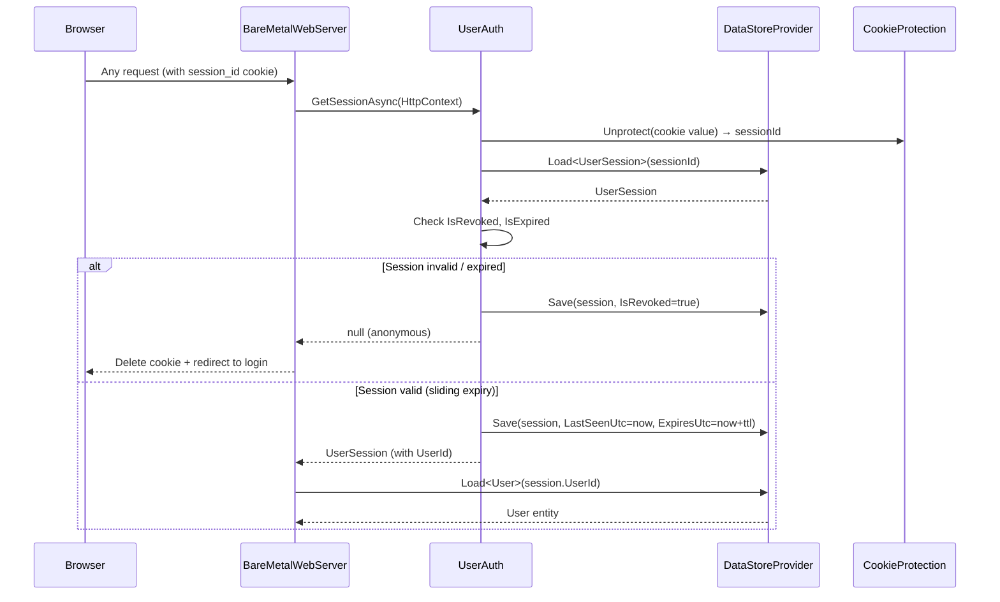
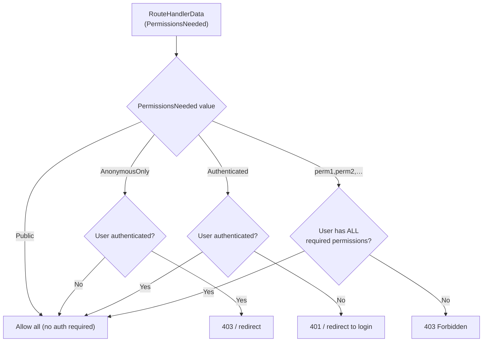
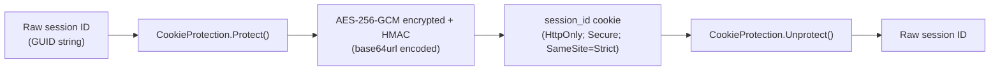
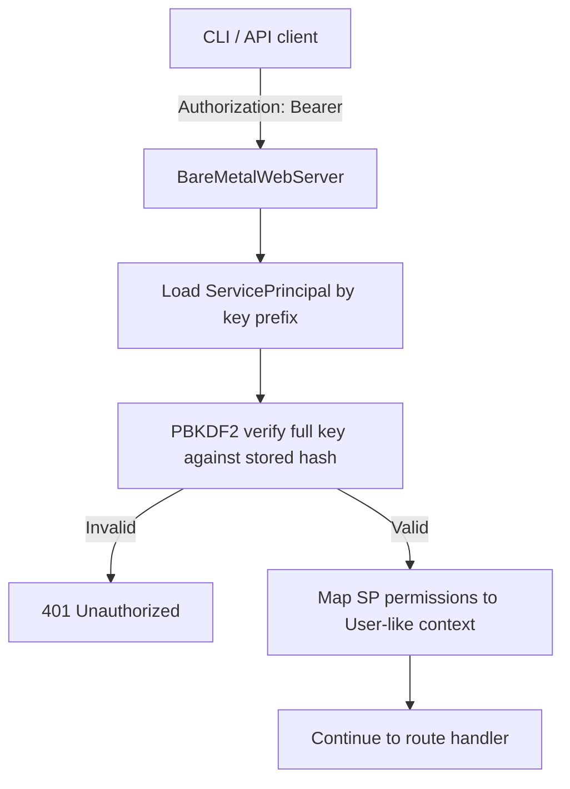

# Authentication & Session Architecture

This document covers the login flow, session management, permission model, and CSRF token lifecycle in BareMetalWeb.

---

## Authentication Flow

```mermaid
sequenceDiagram
    participant Browser
    participant Host as BareMetalWebServer
    participant UA as UserAuth
    participant DS as DataStoreProvider
    participant CP as CookieProtection

    Browser->>Host: POST /account/login<br/>(username + password [+ MFA token])
    Host->>DS: Load User by username index
    DS-->>Host: User entity
    Host->>Host: PBKDF2 password verify
    alt Password wrong
        Host-->>Browser: 401 / login error
    else Password correct
        Host->>DS: Create UserSession<br/>(userId, expiresUtc, rememberMe)
        DS-->>Host: UserSession (with ID)
        Host->>CP: Protect(sessionId) → encrypted token
        Host-->>Browser: Set-Cookie: session_id=<encrypted><br/>HttpOnly; Secure; SameSite=Strict
    end
```

---

## Session Validation (Per-Request)



**Sliding expiry:**
- Standard sessions: 8 hours from last access
- RememberMe sessions: 30 days from last access; cookie `Expires` is reissued to match

---

## Permission Model



### Entity-level Permissions

Each `[DataEntity]` class can declare a comma-separated `Permissions` property on its attribute.  These permissions are collected at startup and added to the root permission set.  The CRUD API routes for an entity enforce these permissions before allowing access.

```
[DataEntity("orders", Permissions = "sales,admin")]
public class Order : BaseDataObject { … }
```

### MFA

When a user has `MfaEnabled = true`, a valid TOTP token must be submitted at login.  The `/account/mfa` route is hidden from the navigation bar for MFA-enrolled users (they are prompted inline at login).

---

## Cookie Protection

Session cookies are protected using `CookieProtection` (DPAPI-style, keys stored in `{dataRoot}/.keys/`):



Keys are rotated automatically; old keys are retained to allow existing cookies to be validated during the rotation window.

---

## CSRF Token Lifecycle

```mermaid
sequenceDiagram
    participant Browser
    participant Host as BareMetalWebServer
    participant CSRF as CsrfProtection

    Browser->>Host: GET /any/form/page
    Host->>CSRF: GenerateToken(sessionId)
    CSRF-->>Host: token (HMAC of sessionId + timestamp)
    Host-->>Browser: HTML form with<br/>&lt;input type="hidden" name="_csrf" value="token"&gt;

    Browser->>Host: POST /any/form/page<br/>(form data + _csrf token)
    Host->>CSRF: ValidateToken(sessionId, formToken)
    CSRF->>CSRF: Verify HMAC, check not expired
    alt Token valid
        Host->>Host: Process form
    else Token invalid / expired
        Host-->>Browser: 403 Forbidden
    end
```

CSRF tokens are tied to the authenticated session ID.  Requests without a valid session always fail CSRF validation.  Token expiry is 1 hour by default.

---

## Service Principal API Keys

For machine-to-machine access (used by the CLI), BareMetalWeb supports API key authentication:



API keys are issued via `/account/apikey` (admin only) and stored as PBKDF2 hashes — the raw key is shown only once at creation time.

---

## Security Headers

Every response includes the following security headers:

| Header | Value |
|--------|-------|
| `Content-Security-Policy` | `default-src 'self'; script-src 'self' 'nonce-{n}'; style-src 'self' 'nonce-{n}'; img-src 'self' data: blob:; font-src 'self'; connect-src 'self'; object-src 'none'; base-uri 'self'; frame-ancestors 'none'; form-action 'self'` |
| `Strict-Transport-Security` | `max-age=31536000; includeSubDomains` (HTTPS requests only) |

The CSP `nonce` is generated fresh for each request and embedded in the page; it is not reused across requests.

The `Strict-Transport-Security` (HSTS) header is only emitted when the request is served over HTTPS (including requests where HTTPS is determined via trusted `X-Forwarded-Proto` headers). This prevents browsers from downgrading to plain HTTP on subsequent visits.

---

_Status: Verified against codebase @ commit c9a5bdc (HSTS header and data query timeout added)_
