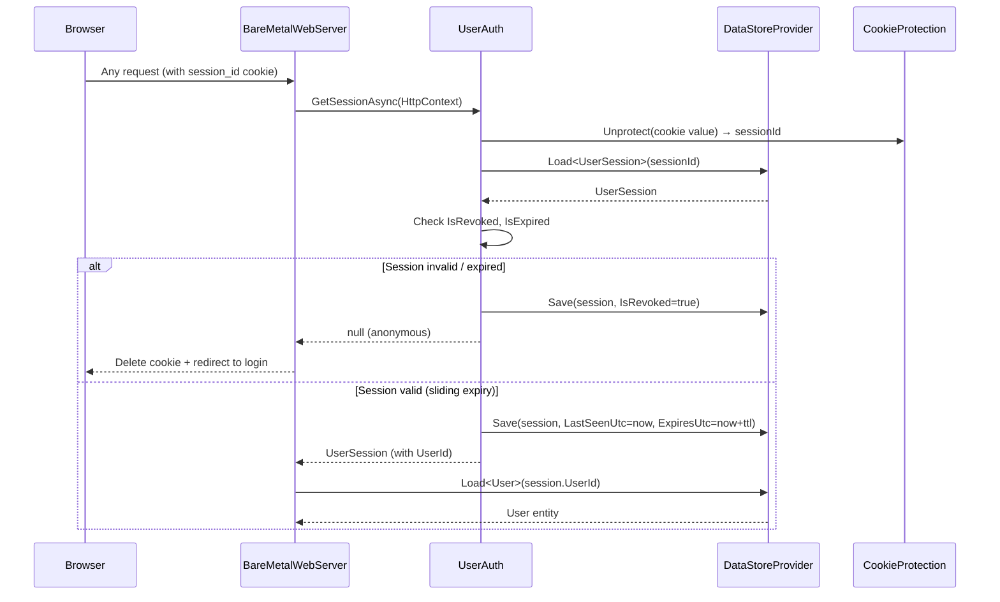
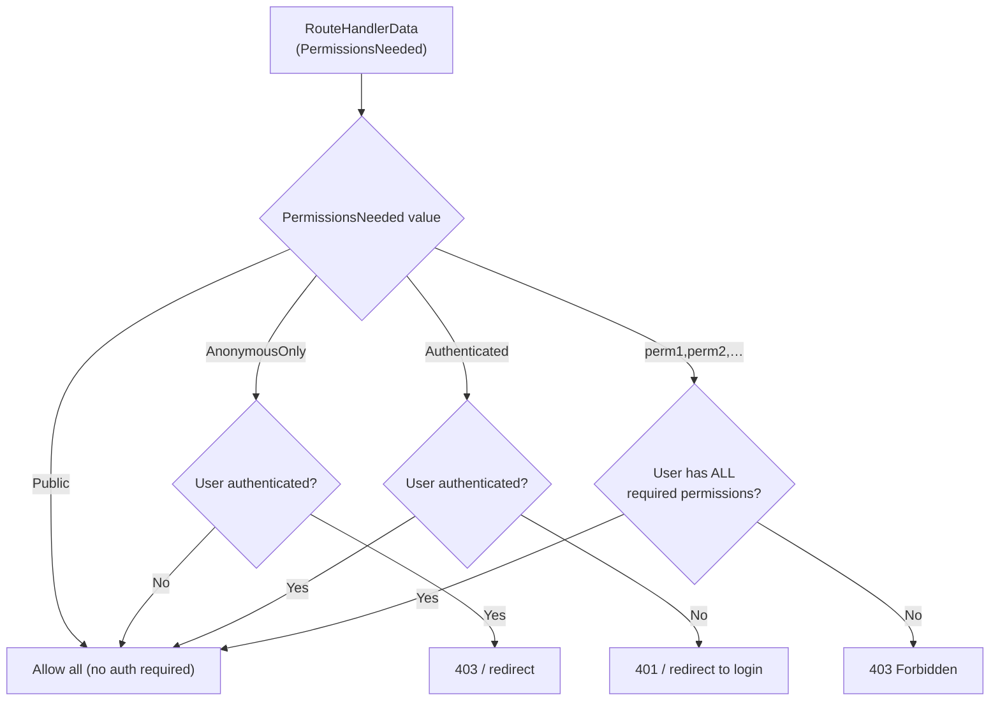
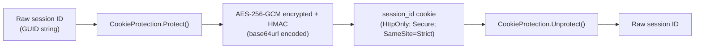
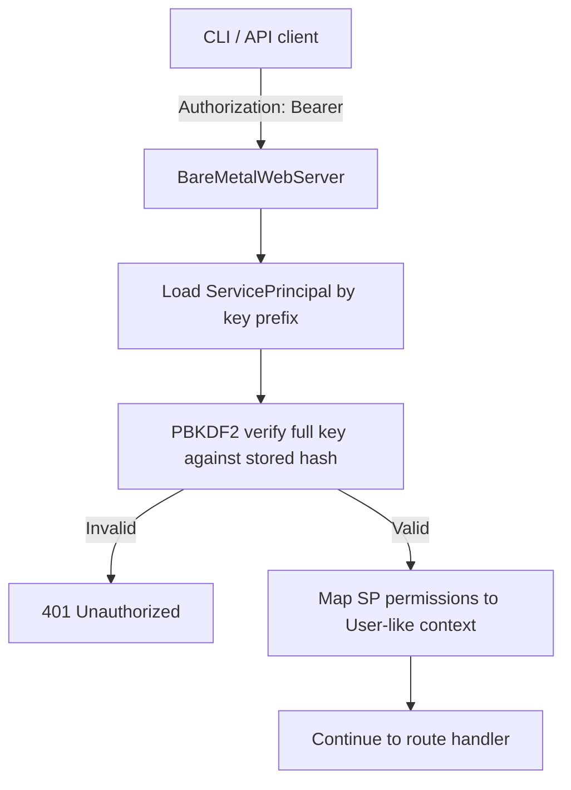

# Authentication & Session Architecture

This document covers the login flow, session management, permission model, and CSRF token lifecycle in BareMetalWeb.

---

## Authentication Flow

```mermaid
sequenceDiagram
    participant Browser
    participant Host as BareMetalWebServer
    participant UA as UserAuth
    participant DS as DataStoreProvider
    participant CP as CookieProtection

    Browser->>Host: POST /account/login<br/>(username + password [+ MFA token])
    Host->>DS: Load User by username index
    DS-->>Host: User entity
    Host->>Host: PBKDF2 password verify
    alt Password wrong
        Host-->>Browser: 401 / login error
    else Password correct
        Host->>DS: Create UserSession<br/>(userId, expiresUtc, rememberMe)
        DS-->>Host: UserSession (with ID)
        Host->>CP: Protect(sessionId) → encrypted token
        Host-->>Browser: Set-Cookie: session_id=<encrypted><br/>HttpOnly; Secure; SameSite=Strict
    end
```

---

## Session Validation (Per-Request)



**Sliding expiry:**
- Standard sessions: 8 hours from last access
- RememberMe sessions: 30 days from last access; cookie `Expires` is reissued to match

---

## Permission Model



### Entity-level Permissions

Each `[DataEntity]` class can declare a comma-separated `Permissions` property on its attribute.  These permissions are collected at startup and added to the root permission set.  The CRUD API routes for an entity enforce these permissions before allowing access.

```
[DataEntity("orders", Permissions = "sales,admin")]
public class Order : BaseDataObject { … }
```

### MFA

When a user has `MfaEnabled = true`, a valid TOTP token must be submitted at login.  The `/account/mfa` route is hidden from the navigation bar for MFA-enrolled users (they are prompted inline at login).

---

## Cookie Protection

Session cookies are protected using `CookieProtection` (DPAPI-style, keys stored in `{dataRoot}/.keys/`):



Keys are rotated automatically; old keys are retained to allow existing cookies to be validated during the rotation window.

---

## CSRF Token Lifecycle

```mermaid
sequenceDiagram
    participant Browser
    participant Host as BareMetalWebServer
    participant CSRF as CsrfProtection

    Browser->>Host: GET /any/form/page
    Host->>CSRF: GenerateToken(sessionId)
    CSRF-->>Host: token (HMAC of sessionId + timestamp)
    Host-->>Browser: HTML form with<br/>&lt;input type="hidden" name="_csrf" value="token"&gt;

    Browser->>Host: POST /any/form/page<br/>(form data + _csrf token)
    Host->>CSRF: ValidateToken(sessionId, formToken)
    CSRF->>CSRF: Verify HMAC, check not expired
    alt Token valid
        Host->>Host: Process form
    else Token invalid / expired
        Host-->>Browser: 403 Forbidden
    end
```

CSRF tokens are tied to the authenticated session ID.  Requests without a valid session always fail CSRF validation.  Token expiry is 1 hour by default.

> **CSRF check order**: All form POST handlers (login, MFA challenge, setup) always run the CSRF check, regardless of whether the request has a valid form `Content-Type`. Non-form requests use an empty form collection that produces no CSRF token, causing the validation to fail immediately. This prevents user-controlled bypass of the CSRF check via Content-Type manipulation.

---

## Service Principal API Keys

For machine-to-machine access (used by the CLI), BareMetalWeb supports API key authentication:



API keys are issued via `/account/apikey` (admin only) and stored as PBKDF2 hashes — the raw key is shown only once at creation time.

---

## Security Headers

Every response includes the following security headers:

| Header | Value |
|--------|-------|
| `Content-Security-Policy` | `default-src 'self'; script-src 'self' 'nonce-{n}'; style-src 'self' 'nonce-{n}'; img-src 'self' data: blob:; font-src 'self'; connect-src 'self'; object-src 'none'; base-uri 'self'; frame-ancestors 'none'; form-action 'self'` |
| `Strict-Transport-Security` | `max-age=31536000; includeSubDomains` (HTTPS requests only) |

The CSP `nonce` is generated fresh for each request and embedded in the page; it is not reused across requests.

The `Strict-Transport-Security` (HSTS) header is only emitted when the request is served over HTTPS (including requests where HTTPS is determined via trusted `X-Forwarded-Proto` headers). This prevents browsers from downgrading to plain HTTP on subsequent visits.

---

_Status: Verified against codebase @ commit c9a5bdc (HSTS header and data query timeout added)_

---

## Rate Limiting

Several endpoints are rate-limited to prevent brute-force and abuse:

| Endpoint | Limit | Window | Key |
|----------|-------|--------|-----|
| `POST /account/login` | 5 attempts | 60 s | IP address |
| `POST /register` | 5 attempts | 60 s | IP address |
| `POST /api/device/code` | 10 requests | 60 s | IP address |
| `POST /api/device/token` | 10 requests | 60 s | IP address |
| `POST /account/mfa` | 5 attempts | 60 s | User ID |

When the rate limit is exceeded, the server returns **429 Too Many Requests** with a `Retry-After` header indicating how many seconds to wait.

The rate limiter uses `ConcurrentDictionary<string, AttemptTracker>` with lock-free `AddOrUpdate` semantics. Stale entries are cleaned up on a sliding window.

---

## API Endpoint Authentication

### MCP (Model Context Protocol)

All MCP requests require authentication. The MCP handler checks `UserAuth.GetRequestUserAsync()` at entry and returns **401 Unauthorized** if no valid session or API key is present.

### Cluster Endpoints

All cluster management endpoints (`/api/cluster/*`) require the **admin** or **monitoring** permission. The handler uses `RequireAdminAsync()` which returns **401** for unauthenticated users and **403** for users lacking the required permissions.

### Binary/Delta API Content-Type

Binary and delta API write endpoints (`POST`, `PUT`, `PATCH`) validate the `Content-Type` header. Requests with a `Content-Type` that matches simple CORS types (`application/x-www-form-urlencoded`, `multipart/form-data`, `text/plain`) are rejected with **415 Unsupported Media Type**. This prevents CSRF via form submissions — non-simple content types trigger a CORS preflight that the browser will block if the origin isn't allowed.

### Request Body Size Limits

Write endpoints enforce a **10 MB** body size limit. Requests with a `Content-Length` exceeding this limit are rejected with **413 Request Entity Too Large** before reading the body.

---

## Error Information Disclosure Protection

API error responses are sanitized to prevent information leakage:

- **Exception messages** (`ex.Message`) are never exposed in HTTP responses — generic error text is returned instead
- **Entity type names** are stripped from 404 responses to prevent entity enumeration attacks

## Enterprise SSO — Microsoft Entra ID (Azure AD)

BareMetalWeb supports enterprise single sign-on via Microsoft Entra ID using the OpenID Connect authorization code flow with PKCE. All OIDC logic is implemented inline (no middleware, no Identity framework) in `EntraIdService.cs`.

### Architecture

```
Browser → GET /auth/sso/login → EntraIdService.BuildAuthorizeUrl()
                                 ├─ Generates PKCE verifier + challenge (S256)
                                 ├─ Generates state nonce (CSRF protection)
                                 ├─ Generates OIDC nonce (token replay protection)
                                 ├─ Stores all three in encrypted HttpOnly cookies (sso_state, sso_verifier, sso_nonce)
                                 └─ Redirects to login.microsoftonline.com/…/authorize

Entra ID → GET /auth/sso/callback?code=…&state=…
                                 ├─ Validates state cookie (CSRF)
                                 ├─ Exchanges code for tokens via POST to /oauth2/v2.0/token (with PKCE verifier)
                                 ├─ Decodes id_token JWT payload
                                 ├─ Validates nonce claim against cookie
                                 ├─ Fetches group memberships via Microsoft Graph API
                                 ├─ Provisions or updates local User entity
                                 ├─ Maps Entra groups → BareMetalWeb permissions
                                 └─ Signs in via UserAuth.SignInAsync()
```

### Endpoints

| Route | Method | Handler | Purpose |
|-------|--------|---------|---------|
| `/auth/sso/login` | GET | `SsoLoginHandler` | Redirect to Entra authorize endpoint |
| `/auth/sso/callback` | GET | `SsoCallbackHandler` | Handle authorization code, exchange tokens, sign in |
| `/auth/sso/logout` | GET | `SsoLogoutHandler` | Clear local session, redirect to Entra front-channel logout |

### Security Controls

- **PKCE** (S256): Protects authorization code exchange against interception
- **State nonce**: Encrypted cookie validated against callback query parameter (CSRF)
- **OIDC nonce**: Stored in cookie, validated against `nonce` claim in id_token (token replay)
- **Rate limiting**: SSO callback is IP-rate-limited (10 attempts per window) using the same `AttemptTracker` as login
- **Audit logging**: All SSO events logged via `BufferedLogger` — initiations, successes, failures, provisioning
- **Error sanitization**: Entra error descriptions are not shown to users; generic messages displayed instead
- **Token trust model**: id_token is trusted from the TLS-protected token endpoint (direct exchange with Microsoft); not used from untrusted sources

### Configuration

```json
{
  "EntraId": {
    "Enabled": true,
    "TenantId": "your-tenant-id",
    "ClientId": "your-client-id",
    "ClientSecret": "your-client-secret",
    "RedirectUri": "/auth/sso/callback",
    "BaseUrl": "https://myapp.example.com",
    "AutoProvisionUsers": true,
    "DefaultPermissions": "user",
    "GroupRoleMappings": {
      "entra-group-object-id": "admin"
    }
  }
}
```

> **`BaseUrl`** (optional): Canonical absolute base URL of the application (e.g. `"https://myapp.example.com"`). When set, all OAuth redirect URIs are built from this value instead of the HTTP `Host` header, preventing Host-header injection attacks. When not set, falls back to the request `Host` header.


### User Provisioning

On first SSO login, a local `User` entity is created with:
- `UserName` / `Email` from Entra claims (`email` or `preferred_username`)
- `DisplayName` from the `name` claim
- Empty `PasswordHash` (SSO users cannot use local login)
- Permissions derived from `DefaultPermissions` + group-to-role mapping
- `CreatedBy` / `UpdatedBy` = `"SSO"`

On subsequent logins, the display name and group-derived permissions are refreshed.

### Files

- `BareMetalWeb.Host/EntraIdService.cs` — OIDC flow, token exchange, user provisioning, group mapping
- `BareMetalWeb.Host/RouteHandlers.cs` — SSO route handlers (lines 502–615)
- `BareMetalWeb.Host.Tests/EntraIdServiceTests.cs` — Unit tests
