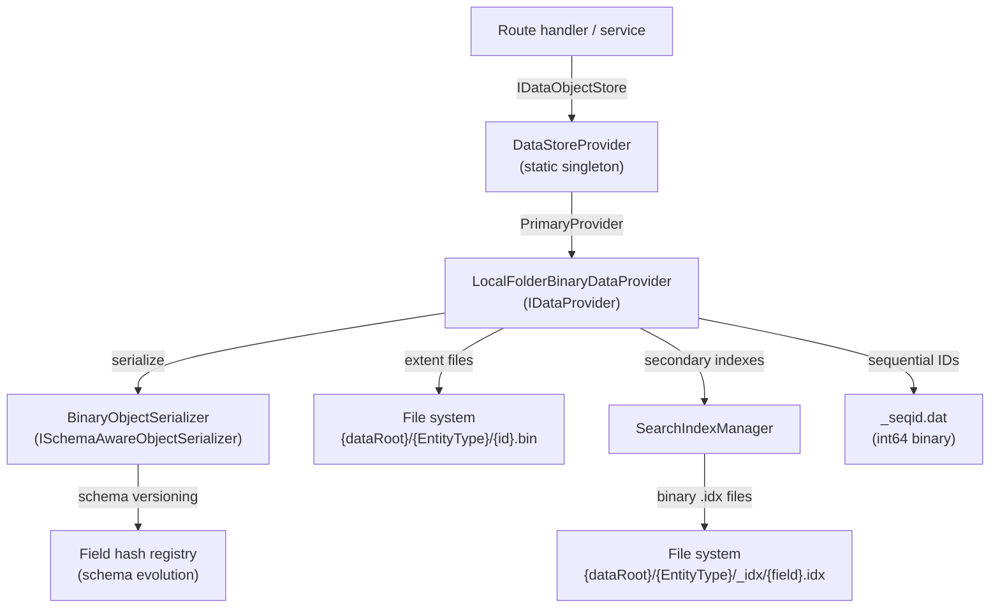
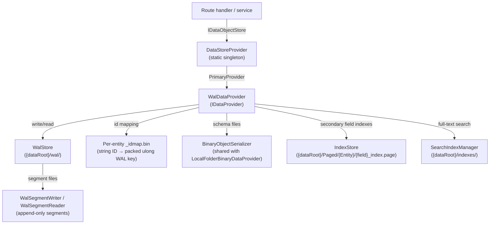
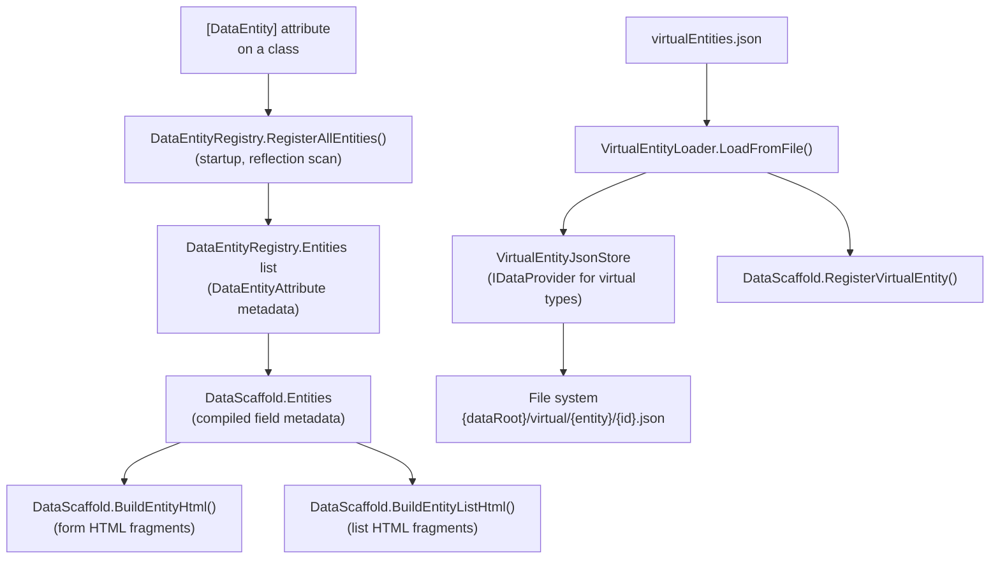
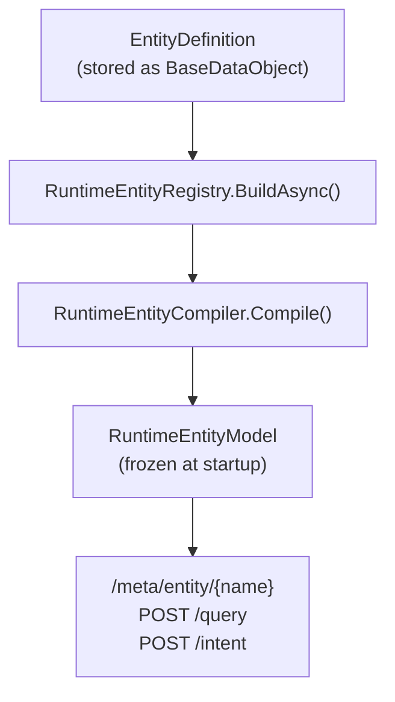
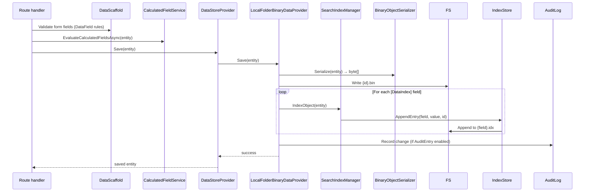
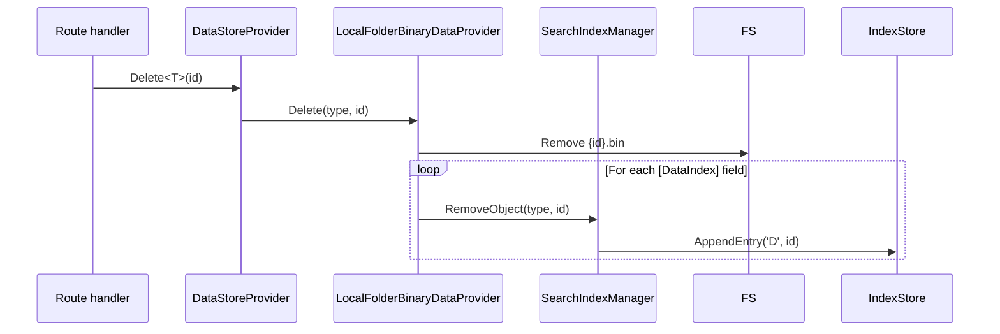
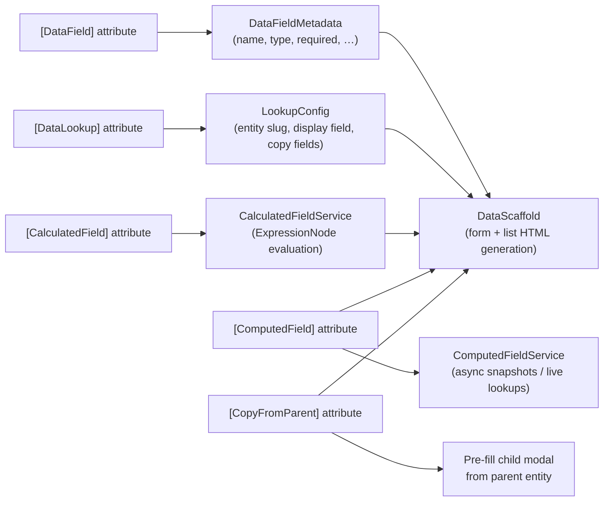
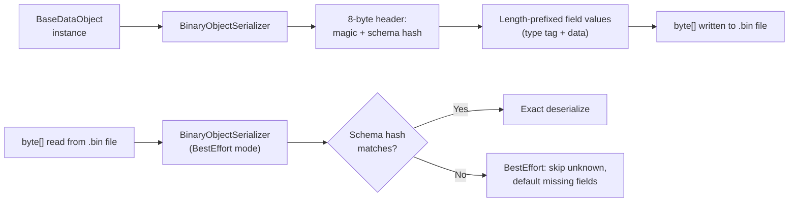

# Data Layer & Storage Architecture

This document covers BareMetalWeb's data storage, entity registration, CRUD lifecycle, and virtual entity system.

---

## Storage Stack

Two `IDataProvider` implementations ship out of the box.  `Program.cs` (`CreateDataStore`) selects one at startup.

### LocalFolderBinaryDataProvider (classic)



### WalDataProvider (WAL-backed)



**Key points:**
- `DataStoreProvider.Current` is the one-stop shop for all data access.
- `LocalFolderBinaryDataProvider` stores each entity instance as a single binary file, grouped by entity type.  Used when WAL is not configured.
- `WalDataProvider` stores all records as commit-log payloads inside a `WalStore` at `{dataRoot}/wal/`.  Each entity type gets a stable `uint32` table-ID derived from the type name; each string record-ID is mapped to a monotonic `uint32` record-ID via a per-entity `_idmap.bin` file, giving a packed `ulong` key consumed by the WAL store.
- `WalDataProvider` maintains secondary field indexes via `IndexStore` (paged files under `{dataRoot}/Paged/`) and `SearchIndexManager` for full-text search. `Query<T>` consults `IndexStore` for `Equals` clauses on `[DataIndex]`-decorated fields before falling back to a full WAL scan, reducing deserializations from O(n) to O(matches).
- Schema evolution is handled via `SchemaReadMode.BestEffort` in both providers: old records with extra/missing fields still load; new fields receive default values.
- Schema files are shared between the two providers so they can coexist in the same data root.
- `LocalPagedFile` is a shared `internal` class (extracted from `LocalFolderBinaryDataProvider`) used by both providers to implement `IPagedFile` paged file storage for `IndexStore`.

---

## Entity Registration Pipeline



### Runtime Entity Definitions



### DataRecord + EntitySchema (ordinal-indexed storage)

`DataRecord` is a `BaseDataObject` subclass that stores field values in an
ordinal-indexed `object?[]` array. `EntitySchema` provides the parallel-array
type descriptor (shared per entity type, not per instance).

```
EntitySchema (per type, shared):
  string[]     Names         Names[ord] → "Email"
  FieldType[]  Types         Types[ord] → StringUtf8
  Type[]       ClrTypes      ClrTypes[ord] → typeof(string)
  bool[]       IsNullable    IsNullable[ord] → false
  bool[]       IsRequired    IsRequired[ord] → true
  bool[]       IsIndexed     IsIndexed[ord] → true
  int[]        MaxLengths    MaxLengths[ord] → 255
  FrozenDictionary<string,int>  NameToOrdinal  (boundary only)

DataRecord (per instance):
  object?[]    _values       _values[ord] → "alice@x.com"
```

**Performance:** ~1–2 ns per field access (array index = base pointer + offset),
matching compiled C# property access and 25–50× faster than dictionary lookup.

**AOT-safe:** FieldPlan getter/setter closures capture the ordinal — no
`Expression.Lambda().Compile()`, no `PropertyInfo`, fully Native AOT compatible.
BaseDataObject structural properties (Key, timestamps, audit trail, ETag, Version)
are serialized as a prefix via dedicated closures — no Activator.CreateInstance.

`EntitySchemaFactory.FromModel(RuntimeEntityModel)` bridges the runtime
compilation pipeline to the data layer.

### WAL Storage for DataRecord

`WalDataProvider` provides non-generic save/load/query/delete methods for
`DataRecord` entities:

- `SaveRecord(DataRecord, EntitySchema)` — serializes via `MetadataWireSerializer`
  with FieldPlan closures, commits to WAL, updates secondary indexes
- `LoadRecord(uint key, EntitySchema)` — reads WAL payload, deserializes into
  pre-created `DataRecord` via `DeserializeInto()` (AOT-safe, no `Activator.CreateInstance`)
- `QueryRecords(EntitySchema, QueryDefinition?)` — full scan with ordinal-based
  clause matching, sorting, and paging
- `DeleteRecord(uint key, EntitySchema)` — WAL tombstone, index cleanup
- All methods share the same deser cache as generic `Load<T>`, keyed by
  `(entityName, key, walPointer)`

---

## CRUD Lifecycle



### Delete Lifecycle



---

## Field Metadata & Computed Fields



---

## Binary Serializer Format



**Type tags supported:** bool, byte, short, int, long, float, double, decimal, DateTime, Guid, string, byte[], List&lt;string&gt;, List&lt;T&gt; (known types registered in `BinaryObjectSerializer.CreateDefault`).

---

## Sequential ID Generation

Sequential IDs are persisted so they survive restarts:

```
{dataRoot}/{EntityType}/_seqid.dat   ← int64 binary, incremented atomically
```

`DefaultIdGenerator` uses `DataStoreProvider.PrimaryProvider.NextSequentialId(entityName)` with an in-memory fallback when the provider is unavailable.

---

## Storage Layout Summary

### LocalFolderBinaryDataProvider layout

```
{dataRoot}/
├── {EntityType}/
│   ├── {id}.bin          ← binary-serialized entity instance
│   ├── _seqid.dat        ← sequential ID counter
│   └── _idx/
│       └── {FieldName}.idx  ← append-only binary index file
├── virtual/
│   └── {entityName}/
│       └── {id}.json     ← JSON-stored virtual entity instance
└── sessions/
    └── {sessionId}.bin   ← binary-serialized UserSession
```

### WalDataProvider layout

```
{dataRoot}/
├── wal/                          ← WalStore root
│   ├── {EntityType}_idmap.bin    ← string ID → packed ulong WAL key
│   └── wal_seg_*.log             ← append-only WAL segment files
├── {EntityType}/
│   ├── schema-{EntityType}-*.json ← schema version files (shared with LocalFolderBinaryDataProvider)
│   └── _seqid.dat                ← sequential ID counter
├── Index/
│   ├── index.registry            ← IndexStore tracked-index registry
│   └── {EntityType}/
│       └── {FieldName}.log.lock  ← per-field exclusive lock file
├── Paged/
│   └── {EntityType}/
│       └── {FieldName}_index.page ← IndexStore secondary field index (LocalPagedFile format)
└── indexes/
    └── {EntityType}.idx          ← SearchIndexManager full-text index
```

---

_Status: Verified against codebase @ commit bd580ba_
