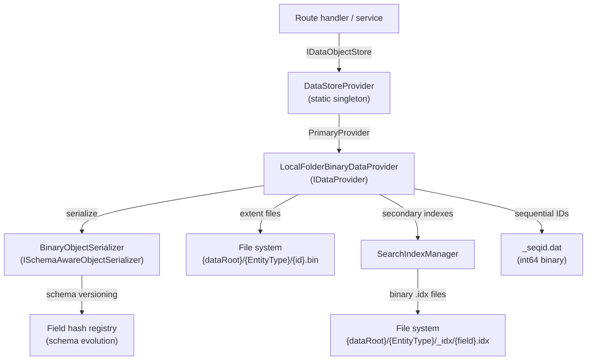
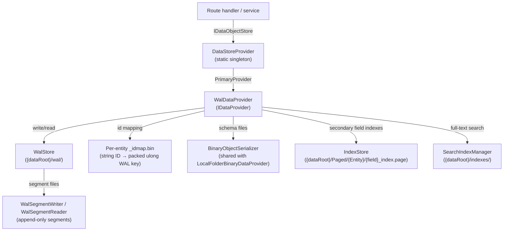
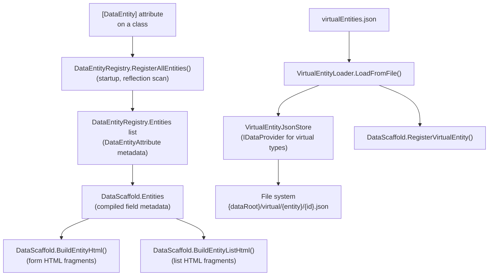
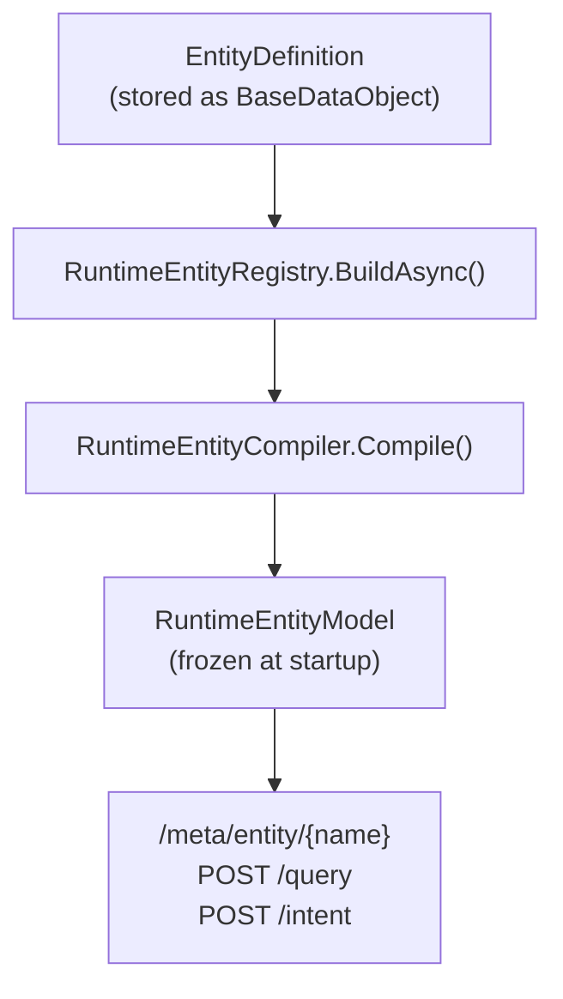
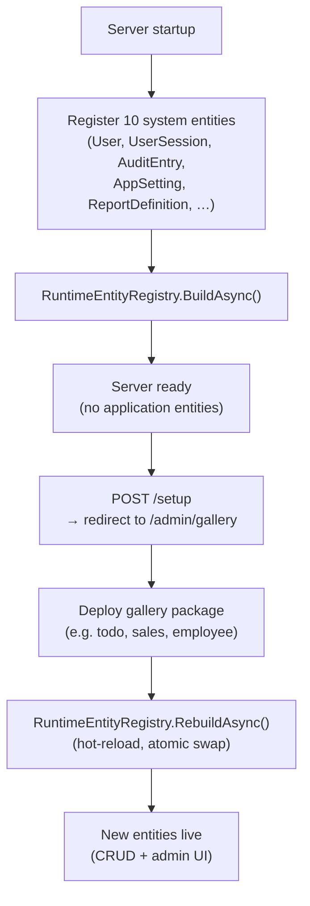
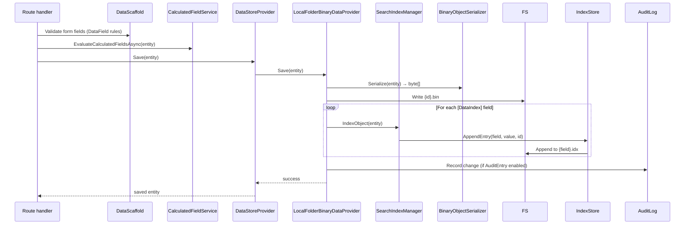
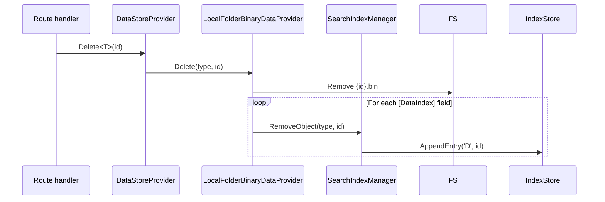
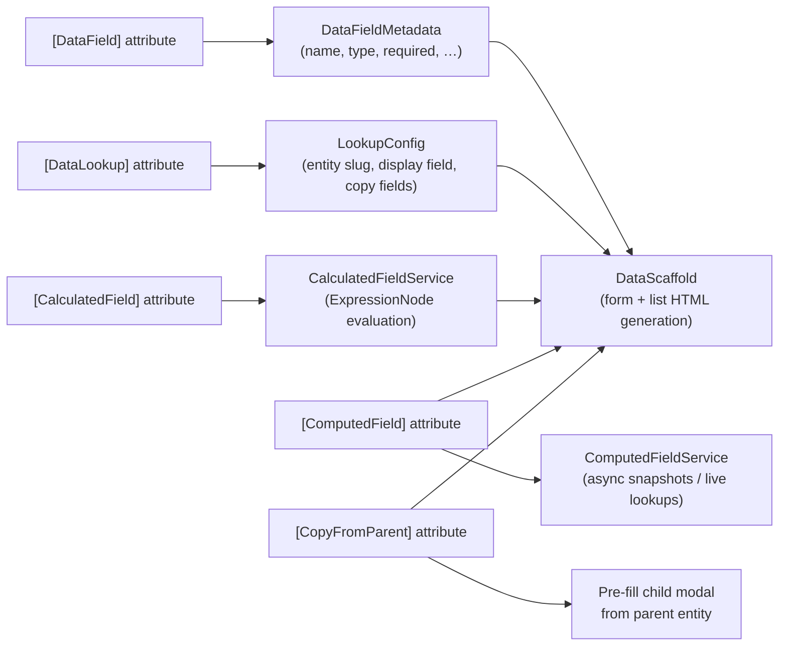
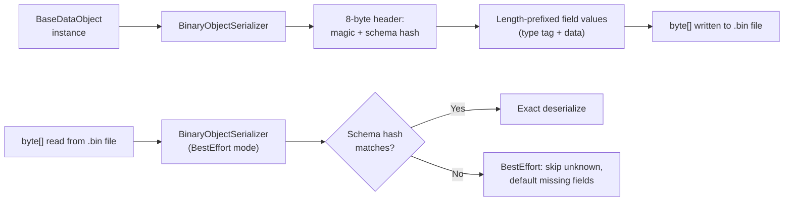

# Data Layer & Storage Architecture

This document covers BareMetalWeb's data storage, entity registration, CRUD lifecycle, and virtual entity system.

---

## Storage Stack

Two `IDataProvider` implementations ship out of the box.  `Program.cs` (`CreateDataStore`) selects one at startup.

### LocalFolderBinaryDataProvider (classic)



### WalDataProvider (WAL-backed)



**Key points:**
- `DataStoreProvider.Current` is the one-stop shop for all data access.
- `LocalFolderBinaryDataProvider` stores each entity instance as a single binary file, grouped by entity type.  Used when WAL is not configured.
- `WalDataProvider` stores all records as commit-log payloads inside a `WalStore` at `{dataRoot}/wal/`.  Each entity type gets a stable `uint32` table-ID derived from the type name; each string record-ID is mapped to a monotonic `uint32` record-ID via a per-entity `_idmap.bin` file, giving a packed `ulong` key consumed by the WAL store.
- **Striped head map** — `WalStore` holds a `WalHeadMap` that tracks the latest committed WAL pointer for every live key.  The map is partitioned into `N` independent shards (default 16, configurable power-of-two) keyed by `tableId & shardMask` (upper 32 bits of the packed key).  Each shard carries its own `ReaderWriterLockSlim` and a pair of sorted `ulong[]` arrays.  Reads (`TryGetHead`) and writes (`BatchSetHeads`) touch only the shard(s) relevant to the keys involved, so concurrent reads against different entity types never contend on the same lock stripe.  The `CopyArrays` snapshot helper merges all shards into a single globally-sorted array for checkpoint writes.
- `WalDataProvider` maintains secondary field indexes via `IndexStore` (paged files under `{dataRoot}/Paged/`) and `SearchIndexManager` for full-text search. `Query<T>` consults `IndexStore` for `Equals` clauses on `[DataIndex]`-decorated fields before falling back to a full WAL scan, reducing deserializations from O(n) to O(matches).
- Schema evolution is handled via `SchemaReadMode.BestEffort` in both providers: old records with extra/missing fields still load; new fields receive default values.
- Schema files are shared between the two providers so they can coexist in the same data root.
- `LocalPagedFile` is a shared `internal` class (extracted from `LocalFolderBinaryDataProvider`) used by both providers to implement `IPagedFile` paged file storage for `IndexStore`.

---

## Entity Registration Pipeline



### Runtime Entity Definitions



### Gallery-First Mode (default)

Gallery-first mode (`Data:LoadCompiledEntities=false`, the default) boots the
server with only system entities registered via metadata.  Application entities
are deployed from gallery packages through the admin UI.



**Key behaviours:**
- `LoadCompiledEntities=true` restores classic mode: all `[DataEntity]`-decorated
  classes are registered via `DataEntityRegistry.RegisterAllEntities()` at startup.
- `RebuildAsync()` caches the init parameters from the first `BuildAsync()` call
  and re-runs `BuildCoreAsync` to pick up newly deployed `EntityDefinition` records.
  Entity lists are atomically swapped — no restart required.
- Setup wizard redirects to `/admin/gallery` after creating the root user so
  new installations are guided to deploy modules.
- Sample data generation requires compiled entities (`LoadCompiledEntities=true`);
  in gallery-first mode the UI directs users to deploy modules from the gallery.

### DataRecord + EntitySchema (ordinal-indexed storage)

`DataRecord` is a `BaseDataObject` subclass that stores field values in an
ordinal-indexed `object?[]` array. `EntitySchema` provides the parallel-array
type descriptor (shared per entity type, not per instance).

```
EntitySchema (per type, shared):
  string[]     Names         Names[ord] → "Email"
  FieldType[]  Types         Types[ord] → StringUtf8
  Type[]       ClrTypes      ClrTypes[ord] → typeof(string)
  bool[]       IsNullable    IsNullable[ord] → false
  bool[]       IsRequired    IsRequired[ord] → true
  bool[]       IsIndexed     IsIndexed[ord] → true
  int[]        MaxLengths    MaxLengths[ord] → 255
  FrozenDictionary<string,int>  NameToOrdinal  (boundary only)

DataRecord (per instance):
  object?[]    _values       _values[ord] → "alice@x.com"
```

**Performance:** ~1–2 ns per field access (array index = base pointer + offset),
matching compiled C# property access and 25–50× faster than dictionary lookup.

**AOT-safe:** FieldPlan getter/setter closures capture the ordinal — no
`Expression.Lambda().Compile()`, no `PropertyInfo`, fully Native AOT compatible.
BaseDataObject structural properties (Key, timestamps, audit trail, ETag, Version)
are serialized as a prefix via dedicated closures — no Activator.CreateInstance.

`EntitySchemaFactory.FromModel(RuntimeEntityModel)` bridges the runtime
compilation pipeline to the data layer.

### WAL Storage for DataRecord

`WalDataProvider` provides non-generic save/load/query/delete methods for
`DataRecord` entities:

- `SaveRecord(DataRecord, EntitySchema)` — serializes via `MetadataWireSerializer`
  with FieldPlan closures, commits to WAL, updates secondary indexes
- `LoadRecord(uint key, EntitySchema)` — reads WAL payload, deserializes into
  pre-created `DataRecord` via `DeserializeInto()` (AOT-safe, no `Activator.CreateInstance`)
- `QueryRecords(EntitySchema, QueryDefinition?)` — full scan with ordinal-based
  clause matching, sorting, and paging
- `DeleteRecord(uint key, EntitySchema)` — WAL tombstone, index cleanup
- All methods share the same deser cache as generic `Load<T>`, keyed by
  `(entityName, key, walPointer)`

---

## CRUD Lifecycle



### Delete Lifecycle



---

## Field Metadata & Computed Fields



---

## Binary Serializer Format



**Type tags supported:** bool, byte, short, int, long, float, double, decimal, DateTime, Guid, string, byte[], List&lt;string&gt;, List&lt;T&gt; (known types registered in `BinaryObjectSerializer.CreateDefault`).

---

## Sequential ID Generation

Sequential IDs are persisted so they survive restarts:

```
{dataRoot}/{EntityType}/_seqid.dat   ← int64 binary, incremented atomically
```

`DefaultIdGenerator` uses `DataStoreProvider.PrimaryProvider.NextSequentialId(entityName)` with an in-memory fallback when the provider is unavailable.

---

## Storage Layout Summary

### LocalFolderBinaryDataProvider layout

```
{dataRoot}/
├── {EntityType}/
│   ├── {id}.bin          ← binary-serialized entity instance
│   ├── _seqid.dat        ← sequential ID counter
│   └── _idx/
│       └── {FieldName}.idx  ← append-only binary index file
├── virtual/
│   └── {entityName}/
│       └── {id}.json     ← JSON-stored virtual entity instance
└── sessions/
    └── {sessionId}.bin   ← binary-serialized UserSession
```

### WalDataProvider layout

```
{dataRoot}/
├── wal/                          ← WalStore root
│   ├── {EntityType}_idmap.bin    ← string ID → packed ulong WAL key
│   └── wal_seg_*.log             ← append-only WAL segment files (CRC32C verified)
├── {EntityType}/
│   ├── schema-{EntityType}-*.json ← schema version files (shared with LocalFolderBinaryDataProvider)
│   └── _seqid.dat                ← sequential ID counter
├── Index/
│   ├── index.registry            ← IndexStore tracked-index registry
│   └── {EntityType}/
│       └── {FieldName}.log.lock  ← per-field exclusive lock file
├── Paged/
│   └── {EntityType}/
│       └── {FieldName}_index.page ← IndexStore secondary field index (LocalPagedFile format)
└── indexes/
    └── {EntityType}.idx          ← SearchIndexManager full-text index (Inverted only)
```

---

## WAL Segment Compaction

### Background

Each `WalStore` segment is an append-only file.  When a record is updated the new
version is appended to the current active segment and the old version is never
deleted.  Over time a single segment may contain dozens of superseded versions of
the same key, wasting disk space and slowing sequential recovery scans.

Compaction collapses a segment to a single-version-per-key snapshot.

### Materialised-View Compaction Strategy (`CompactSegmentFromMaterialisedView`)

`WalStore.CompactSegmentFromMaterialisedView(uint segmentId)` implements a
**read-free compaction** approach that avoids scanning the full original segment
sequentially.  Instead it rebuilds the segment exclusively from the in-memory
state:

```
Old approach (sequential read):
  read full WAL segment (64 MiB)  →  deduplicate versions  →  write compacted segment

New approach (materialised view):
  scan HeadMap (memory)  →  targeted reads (one per live key)  →  write compacted segment
```

**Algorithm (five steps):**

1. **Snapshot HeadMap** (outside the write lock).  `WalHeadMap.CopyArrays()` returns
   sorted parallel `ulong[]` arrays.  Filter to entries whose pointer's upper 32 bits
   equal `segmentId` — these are the live keys whose latest version resides in the
   target segment.  Keys superseded by a newer commit in a later segment are
   naturally excluded.

2. **Targeted disk reads** (outside the write lock).  Open the original segment with
   `FileShare.ReadWrite | FileOptions.RandomAccess` and call
   `TryReadRawOpFromStream()` for each live key using the exact offset from the
   HeadMap.  Raw (potentially compressed) bytes are read and preserved without
   decompression/recompression.  Tombstone ops (`OpTypeDeleteTombstone`) are
   dropped.

3. **Write compacted segment to `.compact` temp file** (outside the write lock).
   Each live key is written as a separate single-op commit batch via
   `WalSegmentWriter`, so each key gets its own unique `Ptr` after compaction.
   A footer index is written at the end.  The file is flushed and fsynced.

4. **Atomic swap under the write lock**.
   a. Atomically rename `wal_seg_N.log.compact` → `wal_seg_N.log` (readers opening
      by filename now see the compacted content).
   b. For each key whose current HeadMap entry still points to `segmentId` (keys
      committed to a newer segment since the HeadMap snapshot are skipped),
      update the HeadMap with the new Ptr (new offset in the compacted file).
      Uses `HeadMap.BatchSetHeads(keys[], ptrs[])` with sorted key arrays.
   The window between rename and HeadMap update is microseconds; any reads in
   this window that fail are acceptable (they return `null`, which the caller can
   retry).

5. **Fsync directory** (outside the write lock, best-effort; no-op on Windows
   where NTFS commits renames atomically).

**Concurrency guarantees:**
- Concurrent readers continue reading the old segment file by name until the
  rename completes.
- Concurrent writes are unblocked for the entire preparation phase (steps 1–3).
- The write lock is held only for the brief rename + HeadMap update in step 4.
- Keys committed to a newer segment between steps 1 and 4 are never downgraded:
  the conditional check in step 4b ensures only keys still resident in
  `segmentId` are touched.

**Precondition:** `segmentId` must not be the currently active segment (the one
being written by live commits).  Call `RotateSegment()` (or wait for auto-rotation)
before compacting a segment.

**Exposed surface:**
- `WalStore.CompactSegmentFromMaterialisedView(uint segmentId)` — core implementation
- `WalDataProvider.CompactSegmentFromMaterialisedView(uint segmentId)` — thin wrapper on `WalStore`

---

## Hardware Acceleration in the Data Layer

BareMetalWeb uses CPU-specific SIMD intrinsics in several hot paths.  All paths
are guarded by `IsSupported` checks and fall back gracefully to portable code.
The `DataLayerCapabilities` class exposes the active code paths as human-readable
strings for the metrics dashboard.

### CRC-32C (WAL checksums) — `WalCrc32C`

Each WAL segment entry includes a CRC-32C checksum.  The implementation selects
the fastest available hardware path at runtime:

| CPU feature | Code path | Granularity |
|---|---|---|
| ARM64 CRC | `Crc32.Arm64.ComputeCrc32C` | 8-byte lanes |
| x86-64 SSE4.2 | `Sse42.X64.Crc32` | 8-byte lanes |
| x86 SSE4.2 | `Sse42.Crc32` | 4-byte lanes |
| Portable | Slicing-by-4 lookup tables (~4× byte-at-a-time) | 4-byte lanes |

### Vector Distance (ANN search) — `SimdDistance`

Cosine, dot-product, and Euclidean distance computations dispatch to the widest
available SIMD instruction set.  All paths use fused multiply-add (FMA) where
available to reduce rounding error and improve throughput:

| CPU feature | Code path | Width |
|---|---|---|
| AVX-512F | `Avx512F.FusedMultiplyAdd` | 16 floats/iter |
| AVX2 + FMA | `Fma.MultiplyAdd` | 8 floats/iter |
| ARM64 AdvSimd | `AdvSimd.FusedMultiplyAdd` (NEON) | 4 floats/iter |
| Portable | `System.Numerics.Vector<float>` (auto-vectorised by JIT) | platform width |

### Key Comparison — `WalLatin1Key32.CompareTo`

The 32-byte Latin-1 index key is stored internally as four `ulong` words.
`CompareTo` byte-swaps each word with `BinaryPrimitives.ReverseEndianness` and
compares the resulting big-endian values directly — a zero-allocation,
branch-minimal comparison that avoids the prior stackalloc + `SequenceCompareTo`.

### Vectorised Column Query Scan — `ColumnQueryExecutor`

When a full-table scan is required (no usable secondary index) and the entity set
contains at least **256 rows**, `WalDataProvider.Query<T>` activates a
batch-vectorised filter path instead of the per-row reflection loop.

**How it works:**

1. All rows are pre-loaded into a `List<T>`.
2. For each `QueryClause` in the query, a typed column array is extracted from the
   loaded objects using the compiled `GetValueFn` delegate (no reflection at scan
   time):
   - Numeric fields (`int`, `long`, `double`, `float`, `bool`, `enum`, `DateTime`,
     `DateOnly`, `TimeOnly`, `TimeSpan`, `decimal`) → typed column array.
   - String / GUID / other fields → scalar per-row evaluation.
3. The column array is swept with `System.Numerics.Vector<T>` portable SIMD
   comparisons (`Equals`, `GreaterThan`, `LessThan`, `GreaterThanOrEqual`,
   `LessThanOrEqual`, `NotEquals`), writing matching row indices into a
   `ulong[]` bitmask.
4. Multi-clause AND queries compose bitmasks via SIMD `ulong` AND (using
   `Vector<ulong>`).
5. The final result is materialised by iterating set bits with
   `BitOperations.TrailingZeroCount`, honouring `skip`/`top` pagination.

**Expected throughput:** `Vector<int>.Count` rows per comparison cycle on the SIMD
path (4–8× on SSE2/AVX2, 4× on ARM NEON). The integer-mask bitmask AND step adds
negligible overhead and enables free multi-clause composition.

**Eligibility gates:**
- `idMap.Count >= 256` (vectorisation threshold)
- `query.Groups.Count == 0` (no nested OR groups; use scalar path for complex logic)
- `query.Clauses.Count > 0` (at least one predicate)

**Fallback:** Clauses with unsupported operators (Contains, StartsWith, EndsWith,
In, NotIn) or non-numeric field types fall back to the scalar
`DataQueryEvaluator.Matches()` per-row loop for that clause, while vectorisable
clauses in the same query still use the SIMD path. Results are AND-composed via
bitmask intersection, so correctness is maintained for any mix of clause types.

`DataLayerCapabilities.ColumnQueryPath` reports the active SIMD tier, lane width,
and activation threshold at runtime (logged at startup and shown in the metrics
dashboard).

### Branchless Bitmask Filter Pipeline — `BitmaskFilterPipeline`

A lower-level, allocation-free predicate evaluation primitive that works on raw
`ReadOnlySpan<T>` column slices rather than entity-object lists.  Designed for
cases where the caller owns flat columnar buffers and wants sub-microsecond
compound filtering without reflection or heap allocation.

**Method signature (as required by the issue):**
```csharp
public static int EvaluateFilter(
    ReadOnlySpan<int>    age,
    ReadOnlySpan<double> score,
    ReadOnlySpan<byte>   active,
    Span<int>            outputIndexes)
```

**How it works:**

1. Rows are processed in blocks of **64** — one 64-bit `ulong` mask covers
   exactly one block.
2. For each block, a separate 64-bit mask is built per predicate using the
   `BuildMask*` helpers.  Each helper iterates the block and sets bit `k` when
   row `baseIndex+k` satisfies the predicate.  The comparisons compile to
   branchless `SETG` / `SETL` / `SETE` (x86) or `CSET` (ARM64) sequences —
   no branch mispredictions even for random-selectivity data.
3. The per-predicate masks are intersected with bitwise AND:
   `combined = maskAge & maskScore & maskActive`.
4. Matching row indices are collected via
   `BitOperations.TrailingZeroCount(combined)` + clear-lowest-set-bit
   (`combined &= combined - 1`).  This inner loop fires only for matching rows;
   zero-bit positions are skipped in O(1).
5. Scanning continues until all rows are processed.

**Why this outperforms branch-heavy loops:**
- A naïve per-row loop with `if (age > 30 && score < 90 && active == 1)` incurs
  branch mispredictions whenever the hit pattern is irregular.  The bitmask
  pipeline evaluates all three predicates unconditionally and collapses them to
  a single `ulong`, so the only branch is in the 64-row outer loop — which is
  almost always predicted correctly.
- Column arrays provide sequential, cache-friendly memory access vs. chasing
  object references through the heap.

**SIMD upgrade path:**
The `BuildMask*` helpers use simple scalar loops.  They are structured so the
inner comparison can be replaced with a `Vector<T>` sweep or an AVX-512
mask-register intrinsic (`_mm512_cmpgt_epi32_mask`) without changing the outer
64-wide aggregation logic.

**Allocation policy:** zero allocations.  The caller provides the output buffer
(`Span<int> outputIndexes`).

`DataLayerCapabilities.BitmaskFilterPipelinePath` describes the active path at
runtime.

---

_Status: Updated @ commit HEAD (2026-03-06) — added BitmaskFilterPipeline section; extended hardware acceleration section with SimdDistance FMA paths, WalLatin1Key32 word comparison, CRC slicing-by-4 software fallback; added striped WalHeadMap description; added WAL Segment Compaction section documenting materialised-view compaction strategy_
