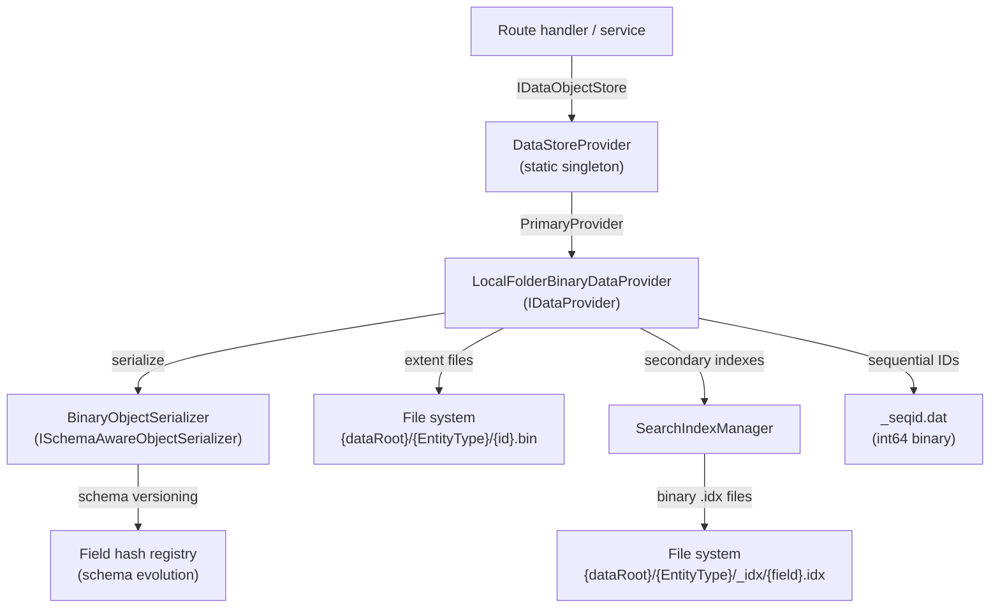
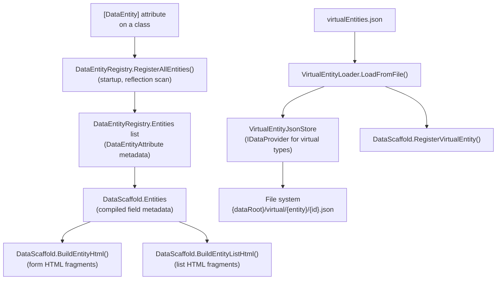
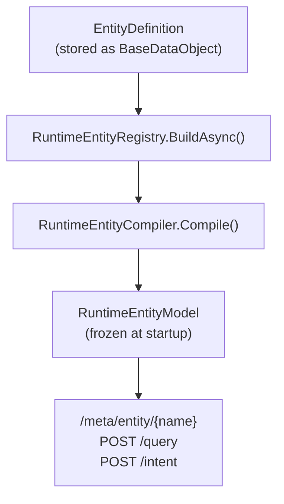
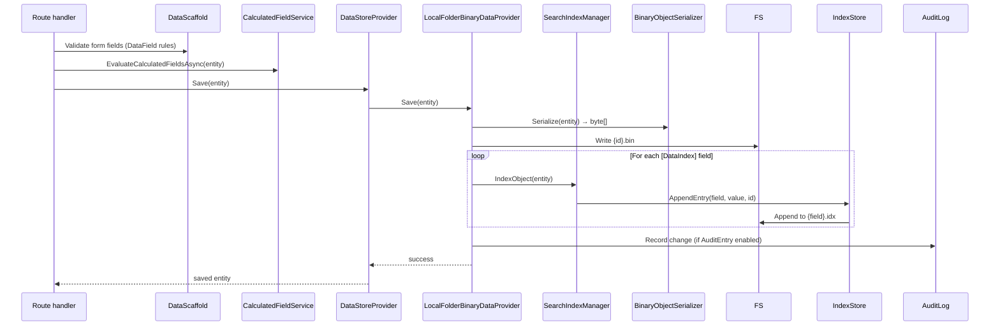
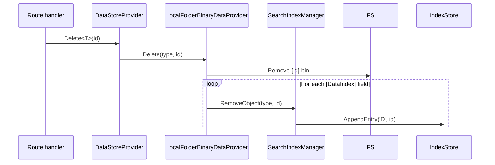
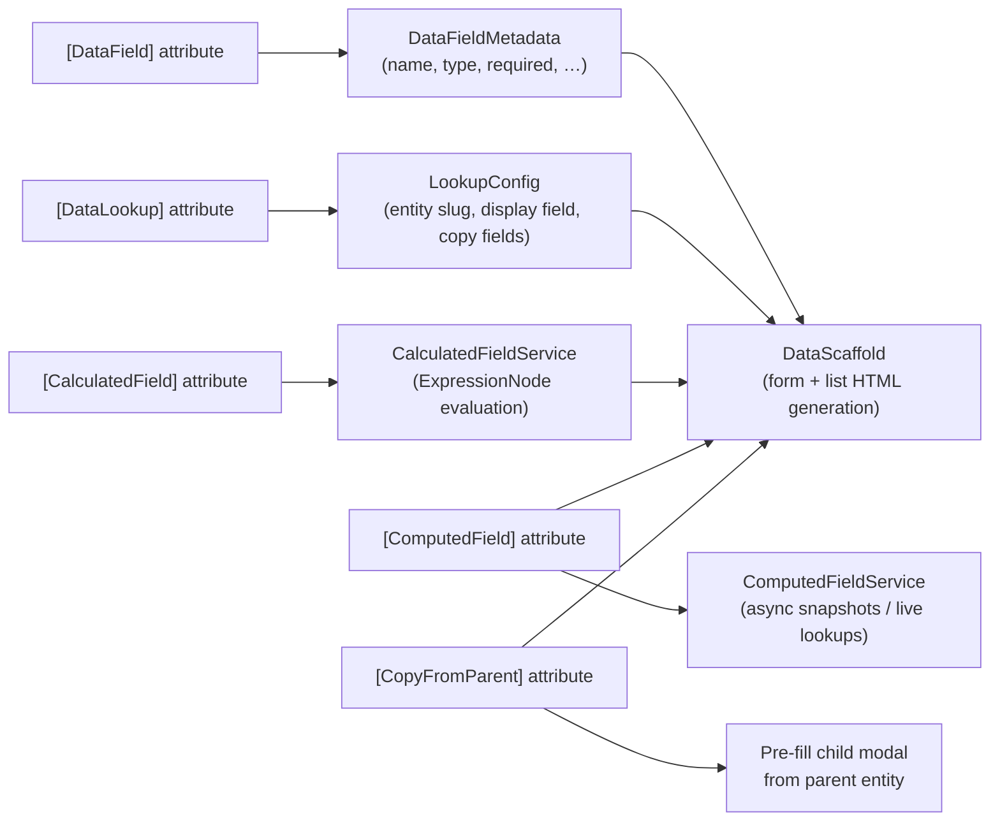
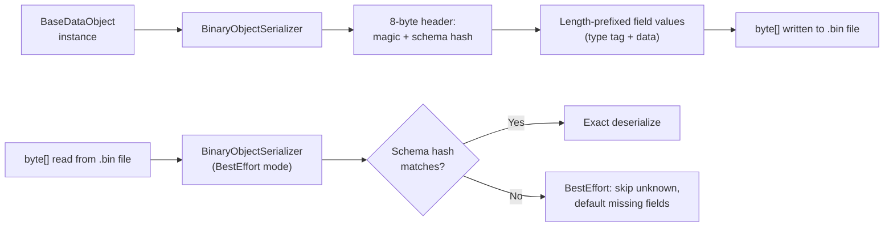

# Data Layer & Storage Architecture

This document covers BareMetalWeb's data storage, entity registration, CRUD lifecycle, and virtual entity system.

---

## Storage Stack



**Key points:**
- `DataStoreProvider.Current` is the one-stop shop for all data access.
- `LocalFolderBinaryDataProvider` stores each entity instance as a single binary file, grouped by entity type.
- Schema evolution is handled via `SchemaReadMode.BestEffort`: old records with extra/missing fields still load; new fields receive default values.

---

## Entity Registration Pipeline



### Runtime Entity Definitions



---

## CRUD Lifecycle



### Delete Lifecycle



---

## Field Metadata & Computed Fields



---

## Binary Serializer Format



**Type tags supported:** bool, byte, short, int, long, float, double, decimal, DateTime, Guid, string, byte[], List&lt;string&gt;, List&lt;T&gt; (known types registered in `BinaryObjectSerializer.CreateDefault`).

---

## Sequential ID Generation

Sequential IDs are persisted so they survive restarts:

```
{dataRoot}/{EntityType}/_seqid.dat   ← int64 binary, incremented atomically
```

`DefaultIdGenerator` uses `DataStoreProvider.PrimaryProvider.NextSequentialId(entityName)` with an in-memory fallback when the provider is unavailable.

---

## Storage Layout Summary

```
{dataRoot}/
├── {EntityType}/
│   ├── {id}.bin          ← binary-serialized entity instance
│   ├── _seqid.dat        ← sequential ID counter
│   └── _idx/
│       └── {FieldName}.idx  ← append-only binary index file
├── virtual/
│   └── {entityName}/
│       └── {id}.json     ← JSON-stored virtual entity instance
└── sessions/
    └── {sessionId}.bin   ← binary-serialized UserSession
```
