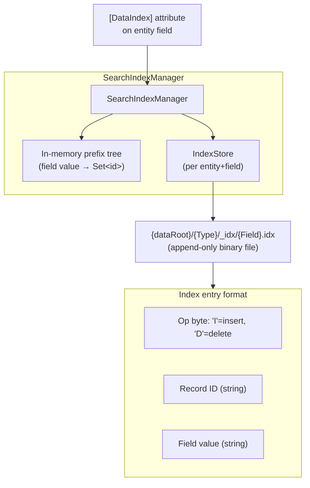
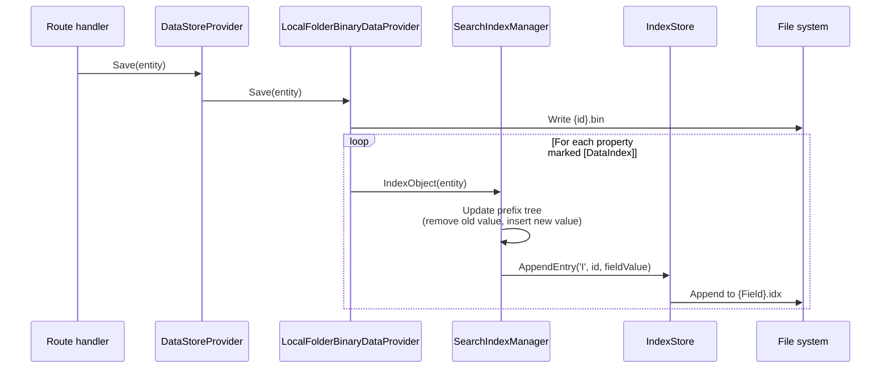
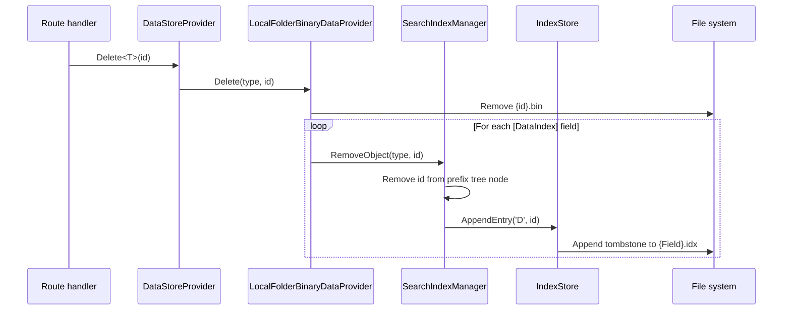
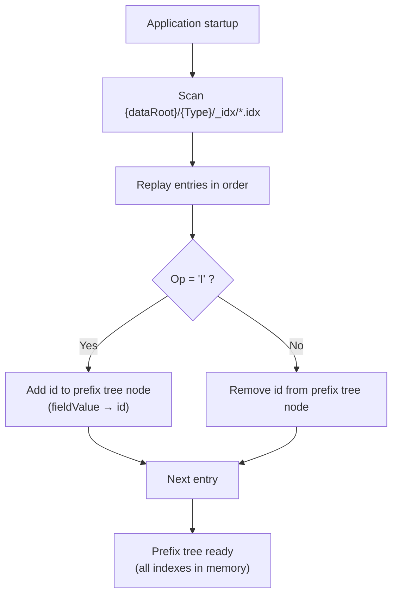
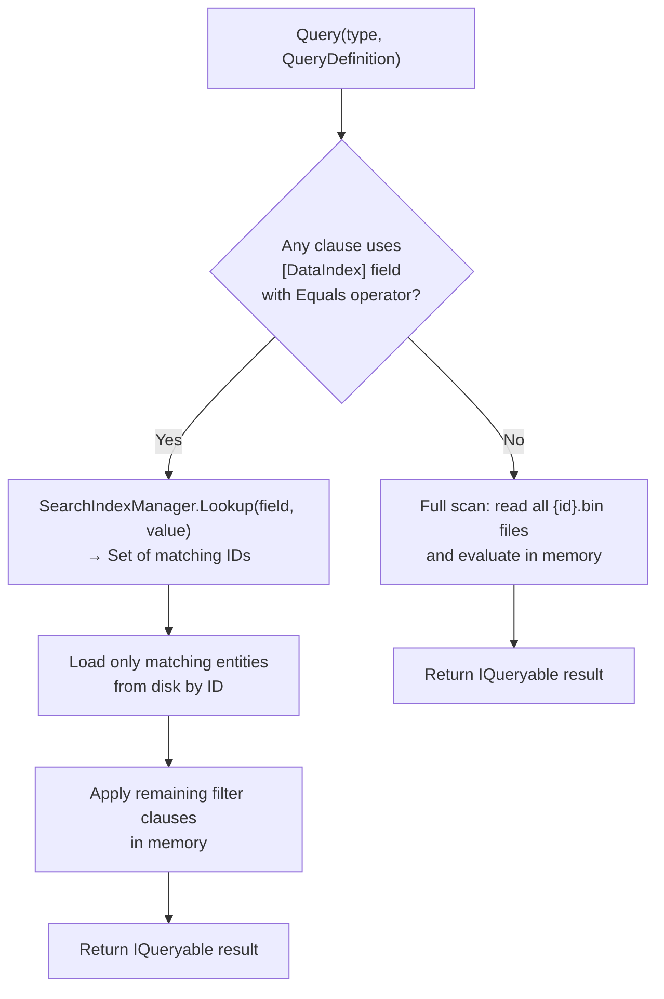

# Indexing Pipeline

This document covers BareMetalWeb's secondary-index architecture, the index creation/update/delete lifecycle, and how indexes accelerate queries.

---

## SearchIndexManager Architecture



**Key facts:**
- Indexes are stored as append-only `.idx` files — deletes write a tombstone `'D'` entry rather than rewriting the file.
- On startup `SearchIndexManager` replays the `.idx` log to rebuild the in-memory prefix tree.
- Average query lookup time: **30–43 microseconds** (sub-millisecond).

---

## Index Creation / Update Lifecycle



---

## Delete Lifecycle



---

## Startup Replay



---

## Query Path: Index Lookup vs Full Scan



**Performance implication:** Always mark high-selectivity filter fields (e.g. `Email`, `UserId`, `CustomerId`) with `[DataIndex]` to avoid full scans on large entity stores.

---

## [DataIndex] Field Mapping

The following fields in the built-in data objects are indexed:

| Entity | Indexed fields |
|--------|---------------|
| `User` | `UserName`, `Email` |
| `UserSession` | `UserId` |
| `Customer` | `Email`, `Company` |
| `Order` | `CustomerId`, `Status` |
| `Product` | `Name`, `Category` |
| `Invoice` | `CustomerId` |
| `OrderLine` | `ProductId` |

Add `[DataIndex]` to any property in a `[DataEntity]` class to create a secondary index automatically.

---

## Index File Format

Each `.idx` file is an append-only binary log:

```
┌──────────────────────────────────────┐
│ Entry 1                              │
│  Op     : 1 byte  ('I' or 'D')      │
│  IdLen  : 4 bytes (int32)            │
│  Id     : IdLen bytes (UTF-8)        │
│  ValLen : 4 bytes (int32)            │
│  Value  : ValLen bytes (UTF-8)       │
├──────────────────────────────────────┤
│ Entry 2 ...                          │
└──────────────────────────────────────┘
```

Compaction (rewriting the file to remove superseded entries) is not currently implemented; the append-only log is replayed on each startup.
