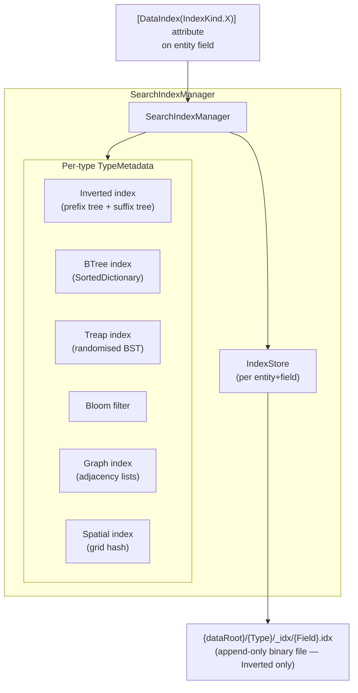
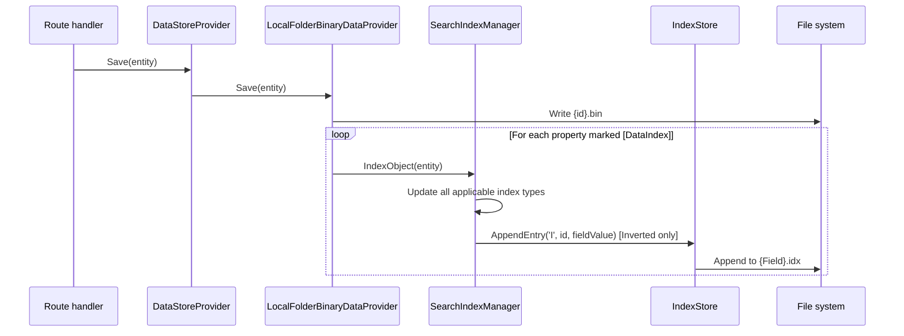
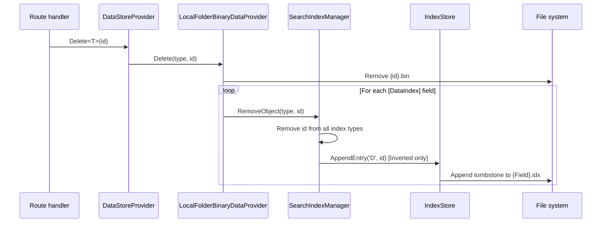
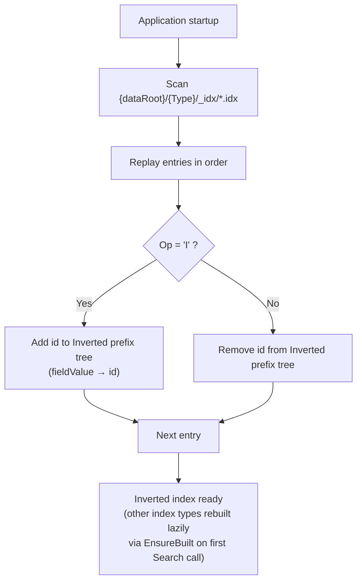
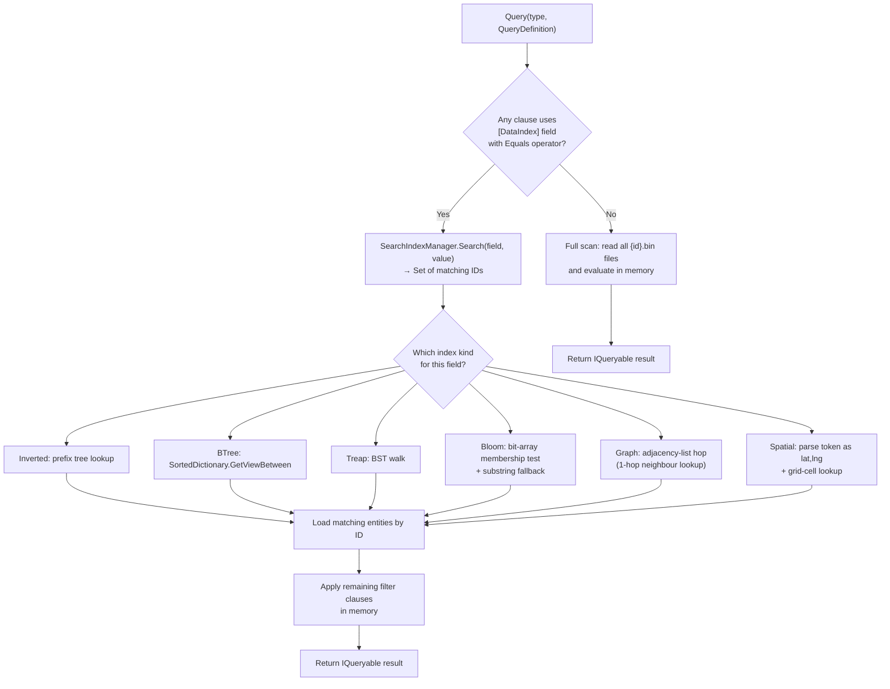

# Indexing Pipeline

This document covers BareMetalWeb's secondary-index architecture, the index creation/update/delete lifecycle, and how indexes accelerate queries.

> **Note:** This document covers `SearchIndexManager` (text/structural indexes on `[DataIndex]`-decorated fields).
> The ANN vector index engine (`VectorIndexManager`) is documented separately in [`vector-index.md`](./vector-index.md).

---

## Index Types Overview

`SearchIndexManager` supports six distinct index structures, selected per-field via the
`[DataIndex(IndexKind.X)]` attribute:

| `IndexKind` | Internal structure | Best for |
|---|---|---|
| `Inverted` (default) | In-memory prefix tree + suffix tree | General full-text search, prefix/substring matching |
| `BTree` | `SortedDictionary<string, HashSet<uint>>` | Sorted/categorical data, prefix range queries |
| `Treap` | Randomised BST (priority + key) | Dynamic data with frequent inserts/deletes |
| `Bloom` | Bit-array with 3 hash functions (10,000 bits) | Fast membership testing; tolerates false positives |
| `Graph` | Forward + reverse adjacency-list maps | Relationship traversal, typed edges between records |
| `Spatial` | Grid-based spatial hash (0.1° cells) | Geographic radius/bounding-box/nearest-N queries |

All six types are **fully in-memory**.  Only the `Inverted` index is persisted to
`.idx` files; the other five are rebuilt from the persisted inverted-index data on
startup via `EnsureBuilt`.

---

## SearchIndexManager Architecture



**Key facts:**
- Only the `Inverted` index writes `.idx` files.  Other index types are rebuilt in memory on startup.
- On startup `SearchIndexManager` replays `.idx` logs then calls `EnsureBuilt` to populate all other index types.
- Average query lookup time: **30–43 microseconds** (sub-millisecond).

---

## Index Creation / Update Lifecycle



---

## Delete Lifecycle



---

## Startup Replay



---

## Query Path: Index Lookup vs Full Scan



**Performance implication:** Always mark high-selectivity filter fields (e.g. `Email`, `UserId`, `CustomerId`) with `[DataIndex]` to avoid full scans on large entity stores.

---

## Index Type Details

### Inverted Index

The default when `[DataIndex]` is used without an explicit kind.

- **Tokenisation:** Field value split on whitespace/punctuation; each token lower-cased.
- **Prefix tree:** Maps `token` → `HashSet<uint>` for fast prefix matching (O(1) per prefix token).
- **Suffix tree:** Also builds a reversed-token → original-token map to support efficient **suffix** search via `SearchSuffix()`.
- **Persisted:** Yes — to `{dataRoot}/{Type}/_idx/{Field}.idx` (append-only binary log).
- **API:** `Search(type, query, loadAll)`, `SearchSuffix(type, suffix, loadAll)`

### BTree Index

- **Structure:** `SortedDictionary<string, HashSet<uint>>` — tokens kept in sorted order.
- **Prefix search:** Uses `GetViewBetween(query, query + '\uffff')` for O(log n + m) range scan.
- **Persisted:** No — rebuilt on startup from inverted-index data.
- **Best for:** Categorical/sorted data (SKUs, codes, hierarchical identifiers).

### Treap Index

- **Structure:** Randomised BST (each node carries a random priority + a key, maintaining BST + max-heap invariant).
- **Performance:** O(log n) expected insert, delete, search.
- **Persisted:** No — rebuilt on startup.
- **Best for:** Fields with frequent insertions and deletions of individual tokens.

### Bloom Filter Index

- **Structure:** Fixed-size bit array (10,000 bits) with 3 independent hash functions.
- **Membership test:** O(1) definitive "not present" or probabilistic "possibly present".
- **False positives:** Possible (can say "present" for values that were never inserted).
- **False negatives:** Impossible.
- **Fallback:** On a positive hit, performs a suffix-tree substring scan to confirm and retrieve actual IDs.
- **Persisted:** No — rebuilt on startup.
- **Best for:** Large-dataset membership checks where a small false-positive rate is acceptable.

### Graph Index

Stores **typed directed edges** between entity records.

- **Structure:** `GraphIndexData` containing:
  - Forward map: `Dictionary<uint nodeId, HashSet<GraphEdge>>` — out-edges from each node.
  - Reverse map: `Dictionary<uint nodeId, HashSet<GraphEdge>>` — in-edges to each node.
  - `GraphEdge` = `(uint TargetId, string EdgeType)`.
- **Insert:** When a `[DataIndex(IndexKind.Graph)]` field is parsed and its value is a valid `uint`, an edge is added from the record's own ID to the referenced ID using the entity type name as the edge label.
- **Search API:**
  - `TraverseGraph(type, startId, maxHops, loadAll, edgeType?)` — BFS traversal up to `maxHops` from a start node.
  - `GetNeighbours(type, nodeId, loadAll)` — direct forward neighbours.
  - `GetReverseNeighbours(type, nodeId, loadAll)` — reverse (in-edge) neighbours.
- **Persisted:** No — rebuilt on startup.
- **Best for:** Foreign-key-style relationship fields where traversal depth or reachability queries are needed (e.g. manager hierarchy, bill-of-materials).

### Spatial Index

Stores geographic coordinate pairs and supports radius/bounding-box/nearest-N queries.

- **Structure:** `SpatialIndexData` containing:
  - `Grid`: `Dictionary<string cellKey, List<GeoPoint>>` — where `cellKey` is `"lat.1dp,lng.1dp"` (0.1° grid cells ≈ 11 km).
  - `GeoPoint` = `(uint Id, double Lat, double Lng)`.
- **Insert:** Field value must be parseable as `"lat,lng"` (e.g. `"51.5,-0.1"`).
- **Search API:**
  - `SearchRadius(type, centerLat, centerLng, radiusKm, loadAll)` — Haversine distance filter within radius.
  - `SearchBoundingBox(type, minLat, maxLat, minLng, maxLng, loadAll)` — rectangular area filter.
  - `SearchNearest(type, centerLat, centerLng, count, loadAll)` → `List<(uint Id, double DistanceKm)>` — nearest-N sorted by distance.
- **Grid cell search:** Candidate cells within `ceil(radius / 11 km)` cell-widths are scanned; exact Haversine distance applied to candidates.
- **Persisted:** No — rebuilt on startup.
- **Best for:** Entity types that store locations (e.g. store locations, delivery addresses, IoT device positions).

---

## [DataIndex] Field Mapping

The following fields in the built-in data objects are indexed:

| Entity | Indexed fields |
|--------|---------------|
| `User` | `UserName`, `Email` |
| `UserSession` | `UserId` |
| `Customer` | `Email`, `Company` |
| `Order` | `CustomerId`, `Status` |
| `Product` | `Name`, `Category` |
| `Invoice` | `CustomerId` |
| `OrderLine` | `ProductId` |

Add `[DataIndex]` to any property in a `[DataEntity]` class to create a secondary index automatically.  Specify the kind for non-default index types:

```csharp
[DataIndex(IndexKind.Graph)]
public string ManagerId { get; set; }   // Relationship field

[DataIndex(IndexKind.Spatial)]
public string Coordinates { get; set; } // "lat,lng" string

[DataIndex(IndexKind.Bloom)]
public string SessionToken { get; set; } // Membership check
```

---

## Index File Format

Each `.idx` file (Inverted index only) is an append-only binary log:

```
┌──────────────────────────────────────┐
│ Entry 1                              │
│  Op     : 1 byte  ('I' or 'D')      │
│  IdLen  : 4 bytes (int32)            │
│  Id     : IdLen bytes (UTF-8)        │
│  ValLen : 4 bytes (int32)            │
│  Value  : ValLen bytes (UTF-8)       │
├──────────────────────────────────────┤
│ Entry 2 ...                          │
└──────────────────────────────────────┘
```

Compaction (rewriting the file to remove superseded entries) is not currently implemented; the append-only log is replayed on each startup.

---

## WAL CRC32C — Hardware Acceleration

WAL segment integrity uses CRC32C checksums computed by `WalCrc32C`.  The implementation
selects the fastest available code path at runtime via `System.Runtime.Intrinsics`:

| CPU feature | Code path |
|---|---|
| SSE4.2 (64-bit) | `Sse42.X64.Crc32` — 8-byte lanes |
| SSE4.2 (32-bit) | `Sse42.Crc32` — 4-byte lanes |
| ARM CRC | `Crc32.Arm.ComputeCrc32C` |
| Fallback | Software lookup-table (portable) |

This is the only place in the codebase that uses CPU-specific SIMD/intrinsics.  The
`SearchIndexManager` distance computations and vector search use plain scalar loops.

---

_Status: Verified against codebase @ commit HEAD (2026-03-05)_
