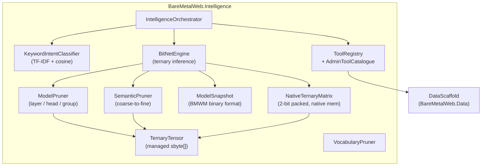

# Intelligence Engine Architecture

BareMetalWeb.Intelligence is a zero-dependency, AOT-safe inference engine for
in-process admin agent conversations on edge devices. It combines keyword
embeddings with a pure C# BitNet b1.58 ternary neural network to classify
natural-language prompts into structured intents that drive the DataScaffold
CRUD layer.

---

## Design Principles

| Principle | Detail |
|-----------|--------|
| Zero NuGet dependencies | No ONNX, no ML.NET, no external runtimes |
| AOT & trim safe | No reflection on hot path, no `dynamic`, no code generation |
| Native memory | All packed weight matrices live outside the GC heap |
| SIMD-first | AVX2 vectorized dot product with NEON stub for ARM |
| Edge-ready | Targets Raspberry Pi 5 (ARM64) and constrained cloud containers |

---

## Component Diagram



---

## Pipeline

The engine follows a fixed pipeline from raw model weights to inference-ready
packed matrices:

```
load model weights (sbyte[] tensors)
  → vocabulary pruning (remove unused tokens)
  → layer pruning (drop low-importance layers)
  → head pruning (drop low-importance attention heads)
  → group-of-4 magnitude pruning (zero groups with L1 below threshold)
  → coarse-to-fine semantic pruning (4-stage, see below)
  → ternary quantization (weights already {-1, 0, +1})
  → 2-bit packing into NativeTernaryMatrix
```

This pipeline runs once. The result can be persisted as a **BMWM snapshot** and
reloaded in ~200 ms instead of ~5 seconds.

---

## Key Components

### NativeTernaryMatrix

The core data structure. Stores ternary weights in a 2-bit packed format in
native (unmanaged) memory.

**Encoding:** each weight occupies 2 bits:

| Weight | Encoding |
|-------:|----------|
|     -1 | `0b11`   |
|      0 | `0b00`   |
|     +1 | `0b01`   |

Four weights pack into one byte. Branchless decode:
```csharp
int w = (e & 1) * (1 - (e & 2));  // e = 2-bit value
```

**Memory layout:**

- Rows are padded to a 32-byte stride (`AlignUp(packedRowBytes, 32)`) for
  cache-line alignment and future AVX-512 compatibility.
- Allocated with `NativeMemory.AllocZeroed`; freed via `IDisposable` with a
  safety-net finalizer.

**Dot product dispatch:**

| Priority | Platform | Method | Width |
|----------|----------|--------|-------|
| 1 | ARM SVE2 | `DotProductSve2` | Scalable (128–2048 bit) — in-register decode, no LUT |
| 2 | ARM SVE | `DotProductSve` | Scalable (128–2048 bit) — LUT decode, fused MLA |
| 3 | x86 AVX-512 | `DotProductAvx512` | 512-bit — 32 weights (8 packed bytes) per iteration |
| 4 | x86 AVX2 | `DotProductAvx2` | 256-bit — 16 weights (4 packed bytes) per iteration |
| 5 | ARM NEON | `DotProductNeon` | 128-bit — 8 weights (2 packed bytes) per iteration |
| 6 | Sparse skip | `DotProductSparse` | Non-zero bytes only (high-sparsity, no SIMD) |
| 7 | All | `DotProductScalar` | 4 weights per iteration |

**Optimizations:**

- **Zero-skip:** if a packed `uint32` (4 bytes = 16 weights) is zero, the
  entire group is skipped — exploits sparsity from pruning.
- **Prefetch:** `Sse.Prefetch0(rowPtr + b + 128)` hides memory latency. On ARM
  this compiles to a no-op (JIT constant `Sse.IsSupported == false`).
- **MatrixStats:** tracks `ZeroByteCount`, `TotalPackedBytes`, and
  `ZeroByteRatio` computed during packing.

### BitNetEngine

Ternary transformer inference engine.

- `LoadTestModel()` — generates synthetic random ternary weights for testing.
- `CompressToNative()` — runs the full pruning pipeline and packs to native.
- `RunInference(int[] tokens)` — forward pass: embed → attention → FFN → output.
- `SaveSnapshot(path)` / `LoadSnapshot(path)` — BMWM binary I/O.

### SemanticPruner (Coarse-to-Fine)

Four-stage pruning pipeline that maximises sparsity while preserving intent
accuracy for the domain task set.

| Stage | Scope | Metric | Cost |
|-------|-------|--------|------|
| 1 — Calibration | Full model | Activation variance, mean abs output | 1 forward pass |
| 2 — Structural pruning | Heads → neurons → blocks | Hidden-state cosine drift | Cheap |
| 3 — Semantic validation | Shortlisted candidates | IntentAst accuracy on calibration corpus | Moderate |
| 4 — Fine group-of-4 | Safe low-importance blocks | Byte-level zeroing for 0x00 packing | Cheap |

The calibration corpus contains 18 domain prompts (e.g. _"show customers who
ordered yesterday"_, _"create a campaign"_) with expected `IntentAst` outputs.
IntentAst comparison is used as the **final judge**, not the inner-loop metric.

### ModelSnapshot (BMWM Format)

Binary snapshot format for instant model loading.

```
Offset  Content
──────  ────────────────────────
0       Magic bytes "BMWM" (4 bytes)
4       Version (int32)
8       Header: layers, dims, heads, matrix count, token count (6 × int32)
32      Matrix descriptors (28 bytes each)
        → rows, cols, stride, offset, length per matrix
var     Token table (length-prefixed UTF-8 strings)
var     Packed matrix data (concatenated)
```

Matrix order: `attn[0], ffn[0], attn[1], ffn[1], ..., embeddings, outputHead`.

**Loading modes:**

| Mode | Method | Speed |
|------|--------|-------|
| Streaming | `ModelSnapshot.Load(path)` | ~200 ms |
| Memory-mapped | `ModelSnapshot.LoadMapped(path)` | Faster for large models |

### IntelligenceOrchestrator

Top-level entry point that coordinates:

1. Intent classification (keyword classifier for fast path)
2. BitNet inference (ternary engine for complex queries)
3. Tool execution via `ToolRegistry` → `AdminToolCatalogue` → DataScaffold

### KeywordIntentClassifier

TF-IDF + cosine similarity classifier for fast intent matching. Works well for
multi-word queries; single keywords may produce low-confidence scores.

### AdminToolCatalogue

Maps classified intents to DataScaffold CRUD operations:

- `list_entities` → `DataScaffold.ListEntityTypes()`
- `get_record` → `DataScaffold.GetRecord()`
- `create_record` → `DataScaffold.CreateRecord()`
- `search` → `DataScaffold.Search()`

---

## Performance

Measured on synthetic 256-dimension, 12-layer model:

| Metric | Before (managed) | After (native packed) | Change |
|--------|------------------:|----------------------:|-------:|
| Working set | 345 MB | 63 MB | -82% |
| GC heap | 319 MB | 0 MB | -100% |
| Inference latency | 192 ms | ~70 ms | -64% |
| Load (full pipeline) | — | ~4.8 s | — |
| Load (snapshot) | — | ~208 ms | 23× faster |
| Snapshot save | — | ~20 ms | — |

Sparsity after pruning:

| Pruning stage | Zero-byte ratio |
|---------------|----------------:|
| Baseline (random) | ~42% |
| + Magnitude pruning | ~51% |
| + Semantic pruning | ~59% |

---

## CLI (`BareMetalWeb.Intelligence.CLI`)

Interactive REPL for testing the inference engine.

```
bmw-ai> hello world
Intent: greeting  Confidence: 0.87  Time: 68ms

bmw-ai> stats
Working set:  63 MB
GC heap:       0 MB
Native alloc: 36 MB

bmw-ai> layers
Layer 0 ATT  Packed: 32,768 bytes  Zero-byte groups: 52.1%
Layer 0 FFN  Packed: 65,536 bytes  Zero-byte groups: 54.3%
...

bmw-ai> semantic
Semantic pruning pass
Groups tested: 120,000
Groups removed: 84,000
Remaining semantic accuracy: 99.2%

bmw-ai> save model.bmwm
Snapshot saved: 36 MB in 20ms

bmw-ai> load model.bmwm
Snapshot loaded: 208ms (23× faster than prune pipeline)

bmw-ai> bench
Running 100 inferences...
Mean: 68ms  P95: 82ms  P99: 91ms
```

---

## SIMD Integration

The Intelligence module extends the SIMD acceleration documented in
[simd-optimizations.md](simd-optimizations.md):

| Component | x86 | ARM | Fallback |
|-----------|-----|-----|----------|
| Ternary dot product | AVX-512 (32/iter) / AVX2 (16/iter) | SVE2 (scalable, in-register) / SVE (scalable, LUT) / NEON (8/iter) | Scalar (4/iter) |
| Prefetch | SSE `Prefetch0` | No-op (JIT constant) | No-op |
| Horizontal sum | `Vector512/256.Sum` | `Sve.AddAcross` (SADDV) | Manual element sum |
| Multiply-accumulate | Separate MUL + ADD | `Sve.MultiplyAdd` (fused MLA) | Separate MUL + ADD |
| Cosine similarity | Scalar int | Scalar int | Scalar int |

The SVE2 path uses `GatherVectorByteZeroExtend` for in-register byte replication
and per-lane shift/mask for branchless 2-bit ternary decode — eliminating LUT
memory access entirely. The SVE path uses LUT decode with scalable `Vector<int>`
that adapts to the hardware SVE width (128–2048 bits).

---

## Test Coverage

125 tests across 10 test files in `BareMetalWeb.Intelligence.Tests`:

| Test file | Count | Coverage |
|-----------|------:|----------|
| NativeTernaryMatrixTests | 22 | Packing, dot product, alignment, stats, disposal |
| SemanticPrunerTests | 19 | All 4 stages, calibration corpus, drift metrics |
| ModelPrunerTests | 16 | Layer/head/group pruning, size calculation |
| ModelSnapshotTests | 12 | Save/load round-trip, memory-mapped, format validation |
| BitNetEngineTests | 12 | Pipeline, inference, snapshot I/O |
| KeywordIntentClassifierTests | 11 | TF-IDF, multi-word, confidence thresholds |
| TernaryTensorTests | 10 | MatVec, encoding, shapes |
| IntelligenceOrchestratorTests | 9 | End-to-end intent → tool execution |
| ToolRegistryTests | 8 | Registration, lookup, catalogue mapping |
| VocabularyPrunerTests | 6 | Token filtering, size reduction |

---

## Future Work

- **Real model weights** — load actual BitNet b1.58 checkpoints instead of
  synthetic random tensors.
- **ONNX embeddings fast path** — sentence embeddings for high-confidence intent
  matching before falling back to ternary inference.
- **Sparse block skip-list** — index zero-byte runs for O(1) skip in very sparse
  matrices.

---

_Introduced in PR [#1254](https://github.com/WillEastbury/BareMetalWeb/pull/1254).
All weights AOT-safe, zero NuGet dependencies, zero GC allocations on the
inference hot path._
