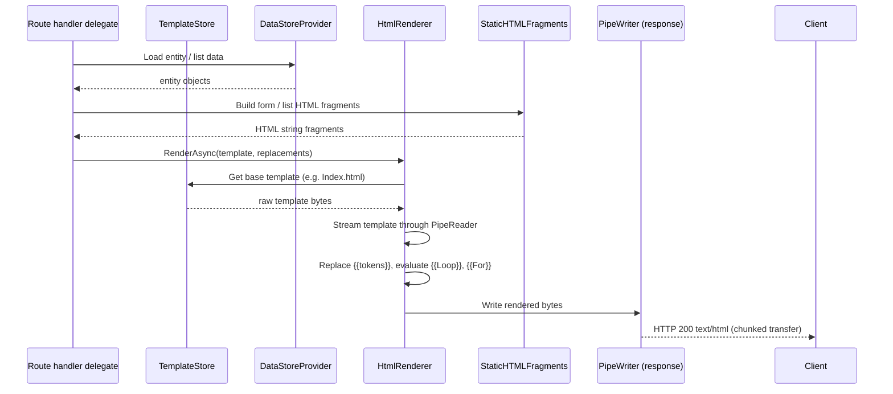
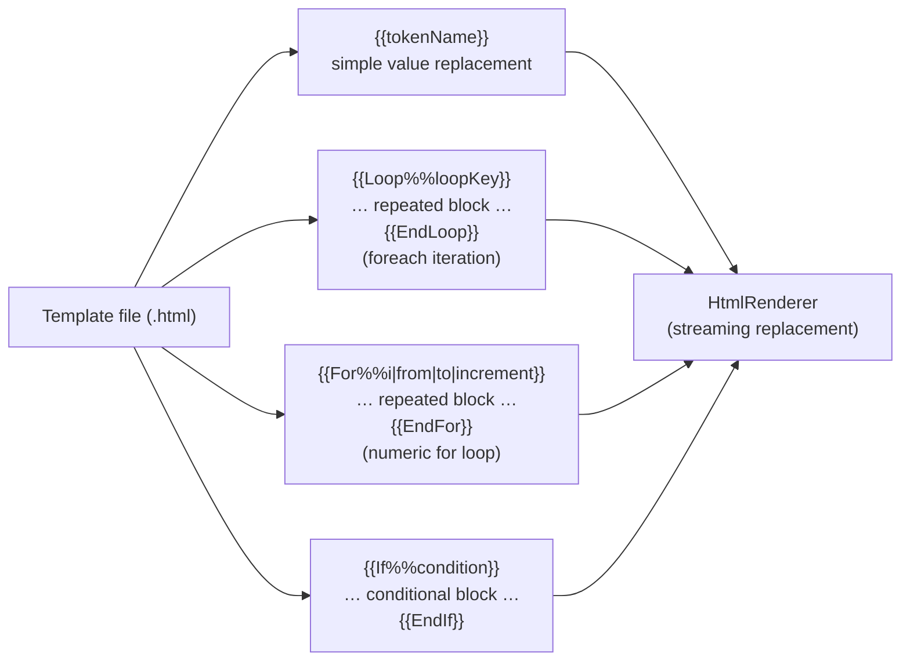
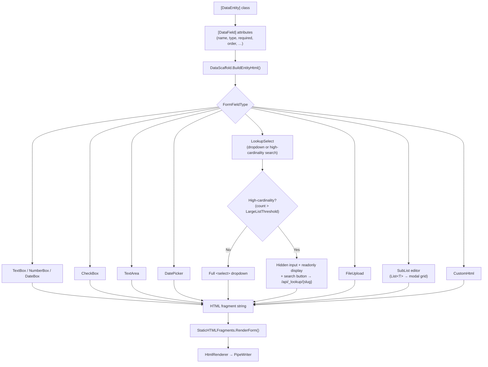
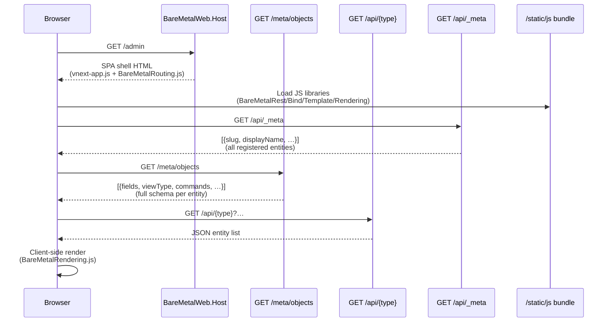
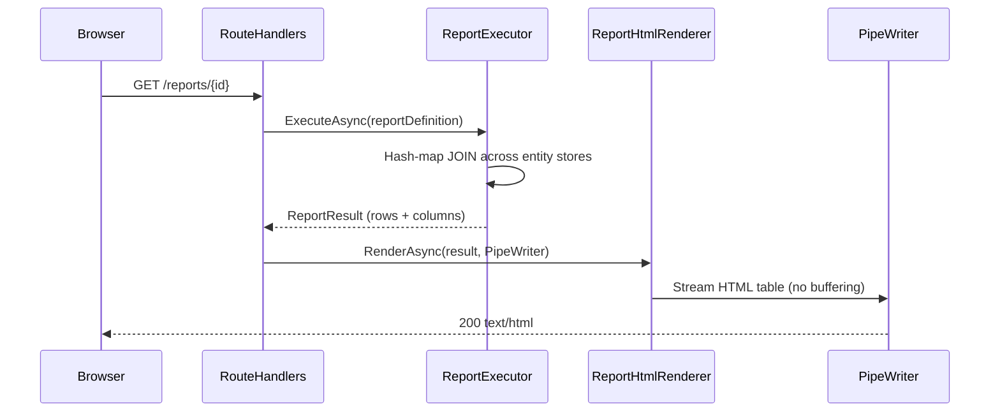

# UI Rendering Architecture

This document covers BareMetalWeb's two rendering paths: the classic server-side rendering (SSR) pipeline and the VNext single-page application (SPA).

---

## SSR Rendering Pipeline

**Why `PipeWriter`?**  Streaming directly to the response pipe avoids buffering the entire HTML page in memory, enabling consistent sub-0.15 ms render times even for large pages.

---

## Template Syntax

**Template location:** `wwwroot/static/*.html` (served from the `TemplateStore`).  
**Evaluation:** Single forward-pass over the template byte stream — no AST, no re-allocation, no Razor compilation.

---

## Form Rendering: DataFieldMetadata → HTML

---

## VNext SPA Path

VNext is the default admin UI served at `/admin` (and `/admin/{*path}`).

### VNext JS Library Responsibilities

| Library | Responsibility |
|---------|---------------|
| `BareMetalRouting.js` | Client-side hash/path routing; decides if a path is a VNext path |
| `BareMetalRest.js` | Thin fetch wrapper for all API calls |
| `BareMetalBind.js` | Two-way data binding between JS objects and DOM inputs |
| `BareMetalTemplate.js` | Mustache-style client-side template evaluation |
| `BareMetalRendering.js` | High-level list/form/sublist HTML generation |
| `vnext-app.js` | Top-level SPA router; wires everything together |

### VNext API Endpoints

| Endpoint | Purpose |
|----------|---------|
| `GET /api/_meta` | Discover all registered entity types |
| `GET /meta/objects` | Full schema for all entities |
| `GET /meta/{object}` | Schema for a single entity |
| `GET /api/{type}` | List entities (with filtering/sorting/paging) |
| `GET /api/{type}/{id}` | Get a single entity |
| `POST /api/{type}` | Create entity |
| `PUT /api/{type}/{id}` | Update entity |
| `DELETE /api/{type}/{id}` | Delete entity |
| `GET /api/_lookup/{slug}` | High-cardinality lookup search |
| `GET /api/metadata/{entity}` | Enhanced per-entity metadata (viewType, parentField, commands) |

---

## Report Rendering

CSV export is available via `GET /api/reports/{id}` (returns `text/csv`).

---

## Output Caching

`OutputCache` (in `BareMetalWeb.Rendering`) stores rendered HTML fragments keyed by a cache key.  It is used for fragments that are expensive to regenerate (e.g. navigation menus) with a configurable TTL.  Dynamic per-request content is never cached.

---

_Status: Verified against codebase @ commit e38d19057e1a55fc1d9a563f5ec6228bb991a0b5_
