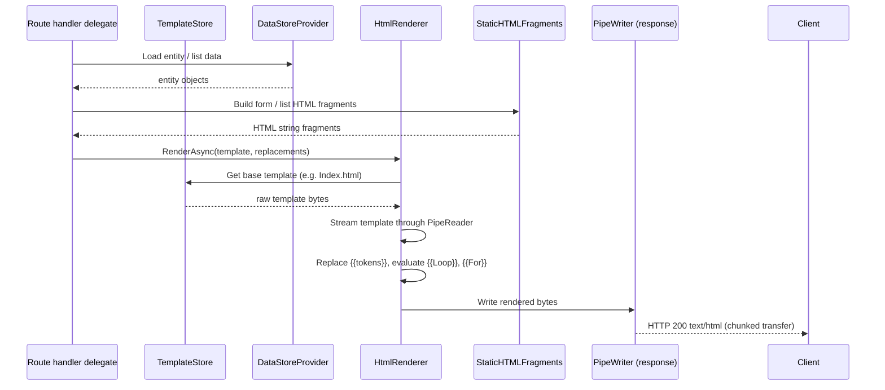
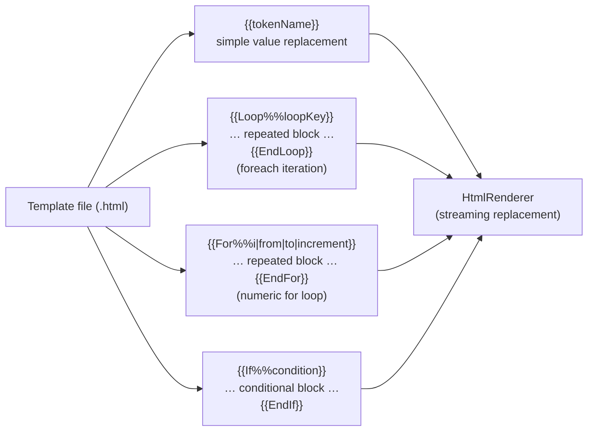
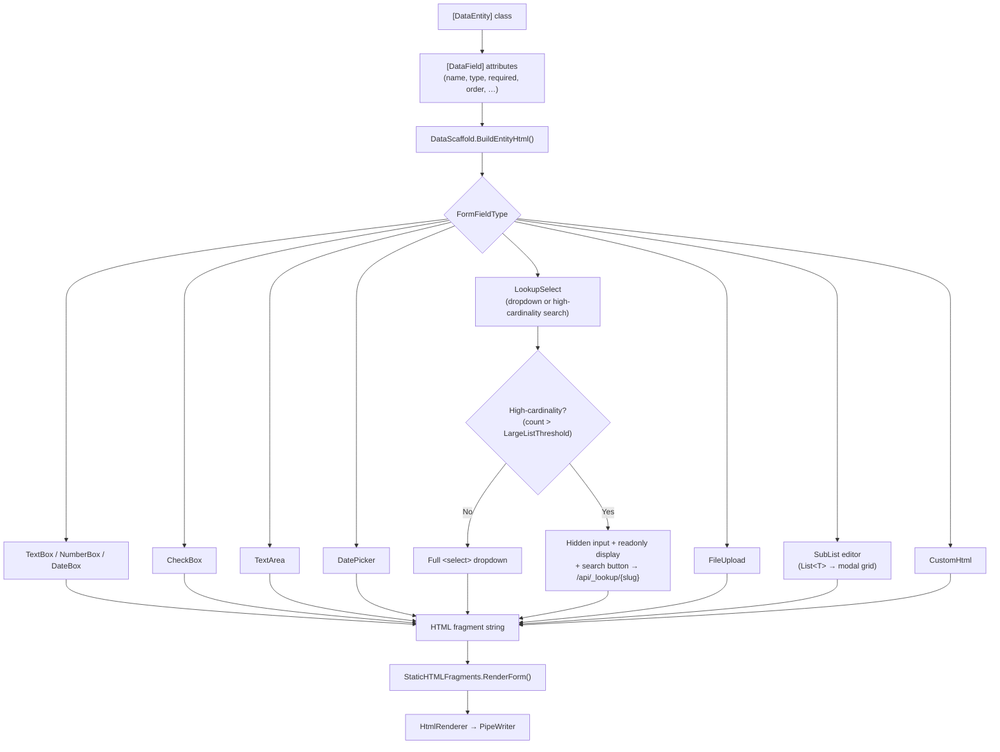
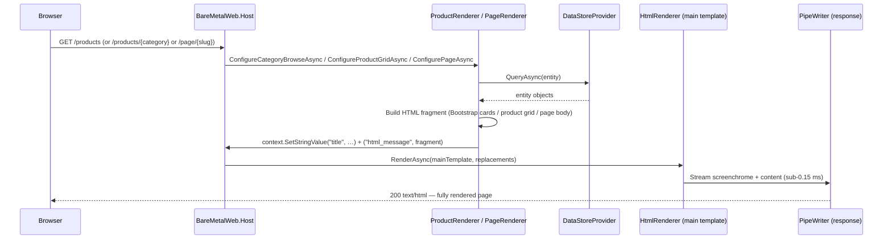
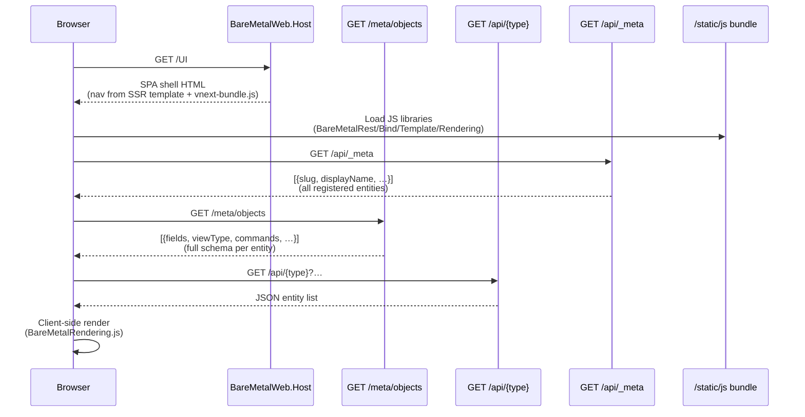
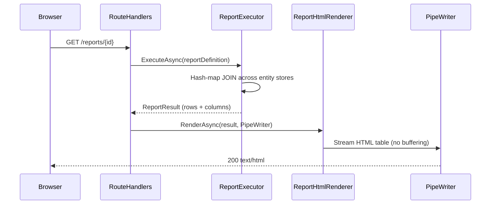

# UI Rendering Architecture

This document covers BareMetalWeb's two rendering paths: the classic server-side rendering (SSR) pipeline and the VNext single-page application (SPA).

---

## SSR Rendering Pipeline



**Why `PipeWriter`?**  Streaming directly to the response pipe avoids buffering the entire HTML page in memory, enabling consistent sub-0.15 ms render times even for large pages.

---

## Template Syntax



**Template location:** `wwwroot/static/*.html` (served from the `TemplateStore`).  
**Evaluation:** Single forward-pass over the template byte stream — no AST, no re-allocation, no Razor compilation.

---

## Form Rendering: DataFieldMetadata → HTML



---

## Commerce & CMS SSR Views

The public-facing commerce storefront and CMS page views are fully server-side rendered.  They reuse the same SSR pipeline as the rest of the application — the route handler populates context values (`title`, `html_message`) and `HtmlRenderer` streams the platform screenchrome (nav, header, footer) together with the page-specific content fragment in a single pass.



**Route table — Commerce & CMS SSR endpoints:**

| Route | Handler | Description |
|-------|---------|-------------|
| `GET /products` | `ProductRenderer.ConfigureCategoryBrowseAsync` | Category listing wrapped in platform screenchrome |
| `GET /products/{category}` | `ProductRenderer.ConfigureProductGridAsync` | Product grid with search/tag filter, inside screenchrome |
| `GET /page/{slug}` | `PageRenderer.ConfigurePageAsync` | CMS page body rendered server-side inside screenchrome |
| `GET /api/pages` | `PageRenderer.ListPagesHandler` | Raw JSON list of published pages |

All four routes are registered with a `TemplatedPage` `PageInfo` (using the main `IHtmlTemplate`), so the full platform screenchrome — navigation bar, header, and footer — is server-rendered on every request.

---

## VNext SPA Path

VNext is the default admin UI served at `/UI` (and `/UI/{*path}`).  The shell itself is server-rendered (nav bar extracted from the main template) but **all content is rendered client-side** by `vnext-app.js` after loading entity schemas and data from the JSON API.



**Key distinction from commerce/CMS SSR views:** The VNext shell reuses only the `<nav>` and `<footer>` sections of the main template.  The `#vnext-content` `<div>` is populated entirely by client-side JavaScript — no server-side HTML fragment is injected for the page body.

### VNext JS Library Responsibilities

| Library | Responsibility |
|---------|---------------|
| `BareMetalRouting.js` | Client-side hash/path routing; decides if a path is a VNext path |
| `BareMetalRest.js` | Thin fetch wrapper for all API calls |
| `BareMetalBind.js` | Two-way data binding between JS objects and DOM inputs |
| `BareMetalTemplate.js` | Mustache-style client-side template evaluation |
| `BareMetalRendering.js` | High-level list/form/sublist HTML generation |
| `vnext-app.js` | Top-level SPA router; wires everything together |

### VNext API Endpoints

| Endpoint | Purpose |
|----------|---------|
| `GET /api/_meta` | Discover all registered entity types |
| `GET /meta/objects` | Full schema for all entities |
| `GET /meta/{object}` | Schema for a single entity |
| `GET /api/{type}` | List entities (with filtering/sorting/paging) |
| `GET /api/{type}/{id}` | Get a single entity |
| `POST /api/{type}` | Create entity |
| `PUT /api/{type}/{id}` | Update entity |
| `DELETE /api/{type}/{id}` | Delete entity |
| `GET /api/_lookup/{slug}` | High-cardinality lookup search |
| `GET /api/metadata/{entity}` | Enhanced per-entity metadata (viewType, parentField, commands) |

---

## Report Rendering



CSV export is available via `GET /api/reports/{id}` (returns `text/csv`).

---

## CSS Theme Bundle System

`CssBundleService` (in `BareMetalWeb.Host`) manages per-theme CSS bundles served at `/static/css/themes/{theme}.min.css`. Each bundle is self-contained: Bootstrap Icons CSS (with local font path rewritten) + the theme's Bootstrap CSS (Google Fonts `@import` stripped for CSP compliance).

### Theme types

| Type | Source | Count |
|---|---|---|
| **Bootswatch** (`DefaultThemes`) | Committed to repository; generated by `node tools/download-assets.js` | 25 |
| **Custom exclusive** (`CustomThemeDefinitions`) | Built from a named Bootswatch base theme + hand-crafted CSS overrides; also committed to repository | 4 |

### Updating bundled assets

Run `node tools/download-assets.js` from the repository root to download/regenerate all theme bundles into `BareMetalWeb.Core/wwwroot/static/`. Commit the output. Alternatively, trigger the **Download Static Assets** GitHub Actions workflow (supports `force_refresh` to re-download everything).

### Custom exclusive themes

| Theme | Base | Design intent |
|---|---|---|
| `jigsaw` | `lumen` | Muted, desaturated palette; reduced motion — sensory-friendly for autistic users |
| `rave` | `cyborg` | Neon colours on near-black; glow effects — 80s dance-culture energy |
| `luminescent` | `darkly` | Deep-space dark with glowing cyan/violet accents — everything emits light |
| `geography` | `sandstone` | Cartographic palette: parchment, stone, slate and muted earth tones |

### Lifecycle

1. **Startup** — `EnsureAssetsAsync(staticRoot)` downloads/writes all Bootswatch themes and builds all custom themes to `wwwroot/static/css/themes/*.min.css`, then calls `BuildBundles` to load them into the in-memory cache (with Brotli and Gzip pre-compressed variants).
2. **Request** — `TryServeAsync(context)` serves from the in-memory cache via `context.ResponseBody` (Kestrel `PipeWriter`, zero-copy socket write). On a cache miss for a known theme, a `Lazy<Task<bool>>` per theme name ensures the bundle is built/downloaded at most once (lazy first-hit load).
3. **Cache headers** — `Cache-Control: public, max-age=31536000, immutable` + ETag + Last-Modified for aggressive browser caching.

---

## JS Bundle System

`JsBundleService` (in `BareMetalWeb.Host`) concatenates and lightly minifies the static JS files into two bundles:

| Bundle | Path | Purpose |
|---|---|---|
| SSR bundle | `/static/js/bundle.js` | Bootstrap + all SSR page helper scripts |
| VNext bundle | `/static/js/vnext-bundle.js` | Bootstrap + BareMetalRouting/Rest/Bind/Template/Rendering + SPA scripts |

Bundles are pre-compressed (Brotli + Gzip) at startup and served via `context.ResponseBody` (`PipeWriter`) for zero-copy writes.

---

## Pre-Compressed Static Asset Cache (`StaticAssetCache`)

`StaticAssetCache` (in `BareMetalWeb.Host`) provides an in-memory, pre-compressed cache for all general static files served under the configured static path prefix.

### Architecture

- **Single contiguous `byte[]` backing buffer** — all raw, Brotli, and Gzip variants are packed end-to-end into one large array at startup. Each cache entry holds three `ReadOnlyMemory<byte>` slices (one per variant) pointing into that array. The GC tracks one allocation instead of thousands.
- **O(1) lookup table** — `Dictionary<string, CacheEntry>` keyed by normalized relative path (e.g. `css/style.css`). Reference is replaced atomically via `Volatile.Write` during rebuild so in-flight reads are never interrupted.
- **Zero-copy serve path** — `ServeAsync` writes the selected `ReadOnlyMemory<byte>` slice directly to `context.ResponseBody` (Kestrel `PipeWriter`). No Stream wrapper, no intermediate buffer, no per-request compression: the kernel DMA's bytes from the CLR heap to the NIC.
- **Selective compression** — Brotli and Gzip variants are stored only when the compressed size is smaller than raw (images and already-compressed formats are stored raw only).
- **Versioned asset detection** — filenames containing 8+ consecutive hex characters (e.g. `app.a1b2c3d4.js`) receive `Cache-Control: public, max-age=31536000, immutable`; all other files use `CacheSeconds` from config.

### Configuration (`appsettings.json` → `StaticFiles:`)

| Key | Default | Description |
|---|---|---|
| `EnableInMemoryCache` | `true` | Build the pre-compressed cache at startup |
| `InMemoryCacheMaxFileSizeBytes` | `5242880` (5 MB) | Per-file size guard; files exceeding this are served from disk. Set to `0` to cache all files. |

### Startup lifecycle

1. `JsBundleService.BuildBundle` runs first (so `bootstrap.bundle.min.js` is available).
2. `StaticAssetCache.Build(rootPath, options)` scans the static root, compresses every compressible file, and packs everything into the backing buffer. Logged as `[StaticAssetCache] Loaded N entries (X.X MB total, X.X MB buffer)`.
3. On each request `StaticFileService.TryServeAsync` checks `StaticAssetCache.TryGetEntry(relativePath, ...)` **before** any disk I/O. A hit → `ServeAsync` → return. A miss → falls through to the standard disk-based path (handles range requests, directory browsing, dynamic compression, oversized files).

### Interaction with `StaticFileService`

`StaticFileService.TryServeAsync` has a fast-path block inserted after path safety validation:

```
prefix check → method check → path parse/sanitize → 
  → [in-memory cache lookup]  ← NEW: O(1), no disk I/O
      hit  → conditional GET (ETag/If-Modified-Since) → ServeAsync (PipeWriter) → return true
      miss → compression selection → metadata read → disk serve (SendFileAsync / Stream)
```

Files excluded from the in-memory cache (too large, unknown MIME type with `AllowUnknownMime=false`, dot-files, `.key` files) continue to use the disk path with the existing metadata cache.

---


`OutputCache` (in `BareMetalWeb.Rendering`) stores rendered HTML fragments keyed by a cache key.  It is used for fragments that are expensive to regenerate (e.g. navigation menus) with a configurable TTL.  Dynamic per-request content is never cached.

---

## Diagnostic Host Banner

A server-info overlay can be injected into any rendered HTML page for scaleout debugging.

**Activation:** Two conditions must both be true:
1. System setting `diagnostics.showHostInfo` set to `True` (managed via the admin settings UI — `WellKnownSettings.ShowHostInfo`)
2. `?showhst=true` query parameter present on the request

The setting is seeded into the system settings store at startup with a default value of `False` and can be toggled at runtime from the admin settings UI without redeploying.

**Content (injected before `</body>` in the response):**

| Field | Source |
|---|---|
| `init` | `X-Forwarded-Host` header (when behind a proxy) or `Request.Host` |
| `svr` | `Dns.GetHostName()` — the machine serving the request |
| `rtt` | `MetricsTracker.GetSnapshot().RecentAverageResponseTime` (last 5-min avg) |
| `payload` | Response HTML byte count before banner injection |

**Coverage:** SSR pages (`HtmlRenderer.RenderPage`), VNext SPA shell (`ServeVNextShell`), and Report pages (`ReportHtmlRenderer.AppendChromeFooter`).

**Security:** Both conditions must be met simultaneously to show the banner. The default system-setting value is `False`; never enable in production without authentication controls.

---

_Status: Updated to document StaticAssetCache (pre-compressed in-memory static asset cache, zero-copy PipeWriter serving, single contiguous buffer, O(1) lookup, versioned asset detection), JS bundle system, and PipeWriter upgrade for CSS/JS bundles. Verified against codebase @ 48e9ccf._
