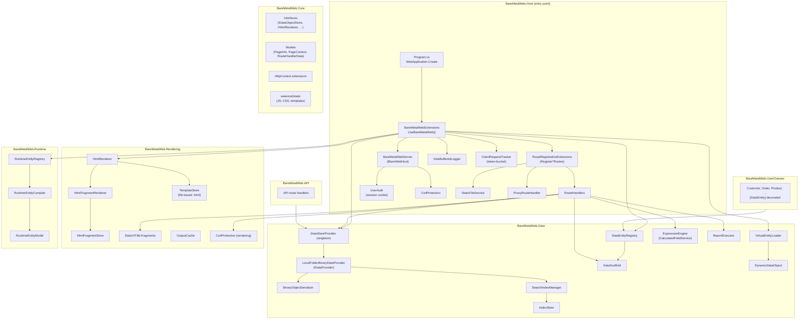
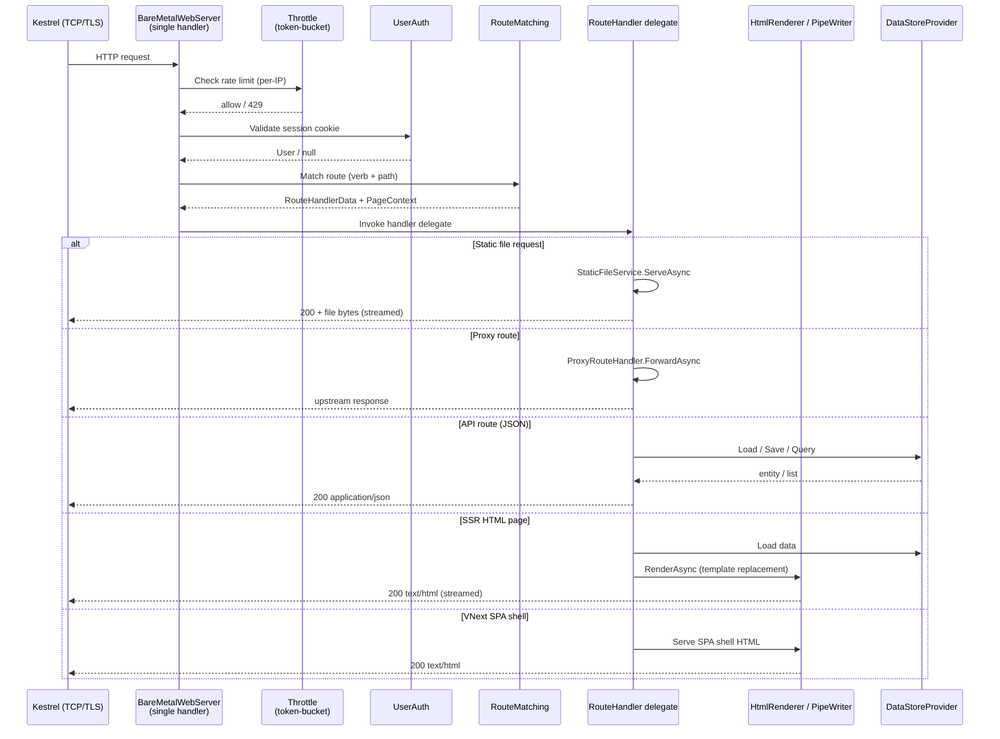

# System Architecture Overview

This document provides a high-level view of BareMetalWeb's component structure, project dependencies, and request lifecycle.

---

## Component Diagram



---

## Project Dependency Map

| Project | Depends on |
|---------|-----------|
| `BareMetalWeb.Host` | Core, Data, Rendering, Runtime, API |
| `BareMetalWeb.Core` | *(no project dependencies — interfaces only)* |
| `BareMetalWeb.Data` | Core |
| `BareMetalWeb.Rendering` | Core |
| `BareMetalWeb.Runtime` | Core, Data |
| `BareMetalWeb.API` | Core, Data |
| `BareMetalWeb.UserClasses` | Data |
| `BareMetalWeb.CLI` | *(standalone — uses HTTP only)* |

---

## Request Lifecycle



---

## Route Divergence

```mermaid
flowchart TD
    Req[Incoming HTTP request] --> Static{Path starts with<br/>/static ?}
    Static -->|Yes| SF[StaticFileService<br/>stream from disk]
    Static -->|No| Proxy{Proxy:Route<br/>configured ?}
    Proxy -->|Yes| PX[ProxyRouteHandler<br/>forward upstream]
    Proxy -->|No| Match[Route dictionary lookup<br/>verb + path]
    Match --> NotFound{Match found?}
    NotFound -->|No| 404[404 Not Found]
    NotFound -->|Yes| Auth{Permission<br/>check}
    Auth -->|Fail| 401[401 / redirect to login]
    Auth -->|Pass| Type{Route type}
    Type --> API[API handler<br/>JSON in/out]
    Type --> SSR[SSR handler<br/>HTML template rendering]
    Type --> VNext[VNext SPA<br/>shell HTML + client-side routing]
    Type --> Report[Report handler<br/>HTML / CSV]
    Type --> Meta[/meta/* runtime<br/>entity metadata]
```

---

## Key Design Principles

- **No middleware pipeline** — all request handling is done inside a single `RequestDelegate` wired via `app.Run(…)`.
- **No dependency injection** — dependencies are created once at startup and captured in closures.
- **Mutable routes** — routes are stored in `BareMetalWebServer.routes` dictionary; new routes can be added at runtime; call `BuildAppInfoMenuOptionsAsync()` to refresh navigation.
- **Performance first** — `PipeWriter`/`PipeReader` streaming, `Span<T>`/`Memory<T>` throughout, minimal allocations.
- **Strong security defaults** — CSP with per-request nonces, CSRF tokens, PBKDF2 password hashing, token-bucket rate limiting.
