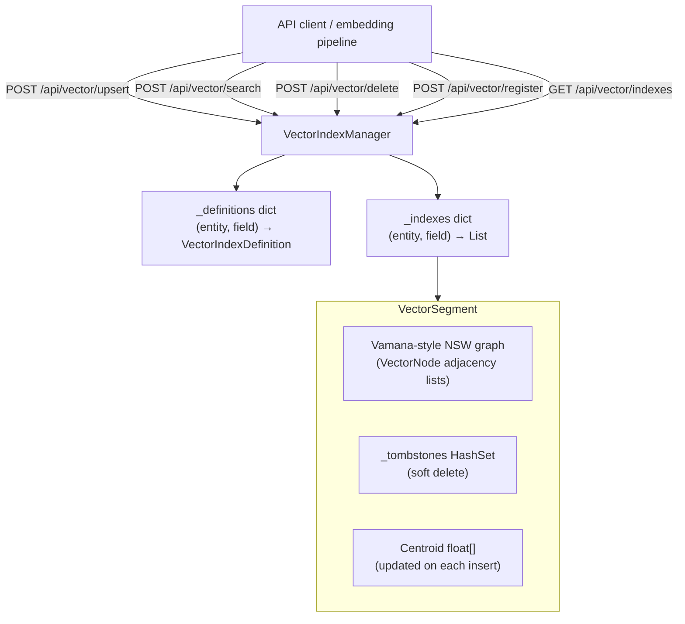
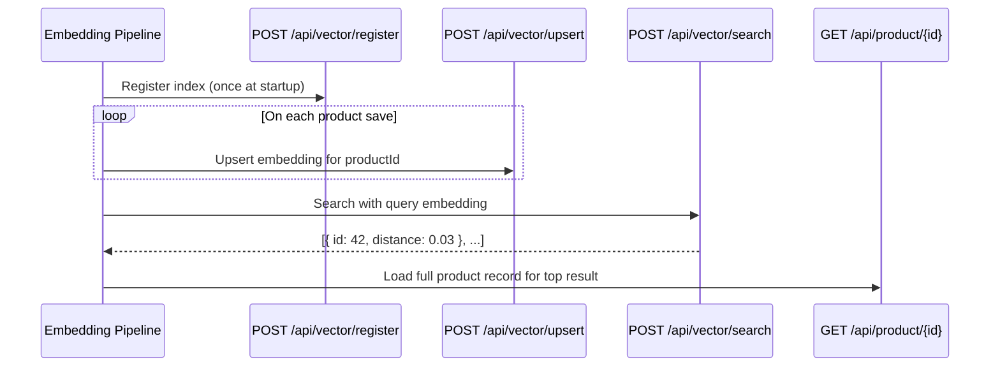

# Vector Index Architecture

BareMetalWeb ships a built-in Approximate Nearest Neighbour (ANN) vector search
engine implemented entirely without external libraries.  It is managed by
`VectorIndexManager` in `BareMetalWeb.Data/VectorIndex.cs`.

---

## Overview

The vector index provides semantic / embedding-based search for any entity field
that stores a `float[]` embedding vector.  It is completely decoupled from the
`SearchIndexManager` (which handles text/BTree/Bloom/Graph/Spatial indexes) and is
accessed via its own dedicated REST API at `/api/vector/*`.



---

## Key Classes

### `VectorIndexManager`

Singleton manager.  Owns all indexes across all entity/field pairs.

**Responsibilities:**
- Maintain a `ConcurrentDictionary<(string EntityType, string Field), VectorIndexDefinition>` 
  of registered index definitions.
- Maintain a `ConcurrentDictionary<(string EntityType, string Field), List<VectorSegment>>`
  of live segments per index.
- Route `Upsert` / `Delete` / `Search` calls to the correct segments.

**Segment selection at search time:** When more segments exist than `maxSegments`
(default 6), the manager selects the nearest segments by centroid distance before
performing beam search, avoiding scanning cold segments.

**Storage:** Index state is currently **in-memory only**.  Vectors must be re-upserted
after a server restart (e.g. replayed from the WAL or an embedding pipeline).  The
`_indexRoot` path is created at startup for future persistence.

---

### `VectorSegment`

An immutable (once compacted) segment of up to 100,000 live vectors.  Implements a
simplified **Vamana-style navigable small-world graph** for ANN search.

**Graph construction (insert):**
1. Run greedy search to find `MaxDegree × 2` nearest neighbours.
2. Prune to `MaxDegree` using α-pruning (α = 0.8) to maintain diversity.
3. Wire forward and reverse edges; trim over-capacity neighbour lists.
4. Recompute the segment centroid.

**Search (beam search):**
1. Start from the entry node.
2. Maintain a candidate min-heap and a result set.
3. Expand neighbours; prune when the worst result is closer than the current
   frontier candidate.
4. Return top-K by distance.

---

### `VectorIndexDefinition`

Metadata record attached to an index registration:

| Field | Type | Description |
|---|---|---|
| `IndexId` | `uint` | Stable numeric ID |
| `EntityTypeId` | `uint` | Entity type hash |
| `FieldId` | `ushort` | Field ordinal |
| `Dimension` | `ushort` | Vector dimensionality (must match all upserted embeddings) |
| `Metric` | `DistanceMetric` | Distance function |
| `MaxDegree` | `int` | Max edges per node (default 32) |
| `Quantizer` | `QuantizationType` | Quantization (None / Float16 / ProductQuantization — Float16 and PQ are reserved for future use) |

---

## Distance Metrics

| `DistanceMetric` | Formula | Best for |
|---|---|---|
| `Cosine` (default) | `1 − (a·b / ‖a‖‖b‖)` | Text embeddings, semantic similarity |
| `DotProduct` | `−(a·b)` (negated so lower = closer) | Pre-normalized embeddings, recommendation |
| `Euclidean` | `√Σ(aᵢ−bᵢ)²` | Spatial embeddings, image features |

All three distance functions are implemented in `SimdDistance` and dispatch to the
widest available SIMD instruction set at runtime, using fused multiply-add (FMA)
where available:

| CPU feature | Code path | Width |
|---|---|---|
| AVX-512F | `Avx512F.FusedMultiplyAdd` | 16 floats/iter |
| AVX2 + FMA | `Fma.MultiplyAdd` | 8 floats/iter |
| ARM64 AdvSimd | `AdvSimd.FusedMultiplyAdd` (NEON) | 4 floats/iter |
| Portable | `System.Numerics.Vector<float>` | platform width |

See `docs/architecture/data-layer.md` for a full hardware-acceleration overview.

---

## REST API

### Register an index

```http
POST /api/vector/register
Content-Type: application/json

{
  "entity":    "product",
  "field":     "Embedding",
  "dimension": 768,
  "metric":    "Cosine",
  "maxDegree": 32
}
```

Returns `201 Created`.

---

### Upsert an embedding

```http
POST /api/vector/upsert
Content-Type: application/json

{
  "entity":    "product",
  "field":     "Embedding",
  "objectId":  42,
  "embedding": [0.12, -0.34, 0.56, ...]
}
```

Returns `204 No Content`.

---

### ANN search

```http
POST /api/vector/search
Content-Type: application/json

{
  "entity": "product",
  "field":  "Embedding",
  "vector": [0.12, -0.34, 0.56, ...],
  "top":    10
}
```

Response:

```json
{
  "entity":  "product",
  "field":   "Embedding",
  "count":   10,
  "results": [
    { "id": 42, "distance": 0.03 },
    { "id": 17, "distance": 0.07 }
  ]
}
```

---

### Delete a vector

```http
POST /api/vector/delete
Content-Type: application/json

{
  "entity":   "product",
  "field":    "Embedding",
  "objectId": 42
}
```

Returns `204 No Content`.  The vector is tombstoned; the ID will not appear in
future search results.

---

### List registered indexes

```http
GET /api/vector/indexes
```

Returns a JSON array of index descriptors:

```json
[
  {
    "entity":    "product",
    "field":     "Embedding",
    "dimension": 768,
    "metric":    "Cosine",
    "maxDegree": 32,
    "count":     1500
  }
]
```

---

## Typical Integration Pattern



---

## Current Limitations

| Limitation | Notes |
|---|---|
| In-memory only | Vectors are not persisted to disk.  Must be re-indexed after restart. |
| No WAL integration | Vector upserts bypass the WAL; they are not replicated in a cluster. |
| No quantization | `Float16` and `ProductQuantization` quantizer types are defined but not implemented. |
| No compaction | Tombstoned vectors accumulate; segments are never compacted or garbage-collected at runtime. |

---

_Status: Updated @ commit HEAD (2026-03-05) — SimdDistance now uses AVX-512F/AVX2+FMA/AdvSimd hardware paths; removed stale "scalar loops only" limitation_
